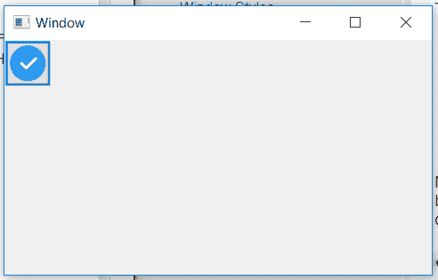

# wxphyon–使用 Create()方法的位图按钮

> 原文:[https://www . geesforgeks . org/wxpyhon-bitmapbutton-using-create-method/](https://www.geeksforgeeks.org/wxpyhon-bitmapbutton-using-create-method/)

在本文中，我们将了解如何使用 create()函数创建位图按钮。Create()函数是一个用于两步创建的按钮创建函数。BitmapButton()构造函数不能用于两步 BitmapButton 创建。
它以不同的位图按钮属性作为参数。

> **语法:** wx。BitmapButton.Create(self，parent，id=ID_ANY，bitmap=NullBitmap，pos=DefaultPosition，size=DefaultSize，style=0，validator=DefaultValidator，name=ButtonNameStr)
> 
> **参数:**
> 
> | 参数 | 输入类型 | 描述 |
> | --- | --- | --- |
> | 父母 | wx。窗户 | 父窗口。不应该是无。 |
> | 身份证明（identification） | wx.窗口标识 | 控件标识符。值-1 表示默认值。 |
> | 位图 | wx(地名)。点阵图(Bitmap) | 要显示的位。 |
> | 刷卡机 | wx。要点 | 窗口位置。 |
> | 大小 | wx。窗户 | 窗口大小。 |
> | 风格 | 长的 | 窗口样式。 |
> | 验证器 | wx。验证器 | 窗口验证器。 |
> | 名字 | 线 | 窗口名称。 |
> 
> **返回类型:**
> 布尔

**代码示例:**

```
import wx

class Mywin(wx.Frame):

    def __init__(self, parent, title):
        super(Mywin, self).__init__(parent, title = title, size =(250, 150))
        self.InitUI()

    def InitUI(self):
        self.locale = wx.Locale(wx.LANGUAGE_ENGLISH)
        self.panel = wx.Panel(self)
        self.btn = wx.BitmapButton()
        bmp = wx.Bitmap('right.png')

        # CREATE BITMAPBUTTON USING Create() function 
        self.btn.Create(self.panel, id = wx.ID_ANY, bitmap = bmp,
                          size =(bmp.GetWidth()+10, bmp.GetHeight()+10))

        self.SetMinSize((400, 250))
        self.Centre()
        self.Show(True)

ex = wx.App()
Mywin(None, 'Window')
ex.MainLoop()
```

**输出窗口:**
