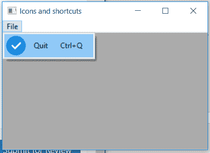

# wxPython–在 wx 中添加带有 menuitem 的图像。菜单栏

> 原文:[https://www . geesforgeks . org/wxpython-add-image-with-menuitem-in-wx-menubar/](https://www.geeksforgeeks.org/wxpython-add-image-with-menuitem-in-wx-menubar/)

在本文中，我们将学习如何添加一个位图图像，该图像带有与 wx 的 menubar 对象中的菜单相关联的 menuitem。菜单栏类。

**步骤:**
**1。**创建 wx 的菜单栏对象。菜单栏类。
**2。**创建 wx 的菜单对象。菜单类。
**3。**使用 wx 创建一个 MenuItem。MenuItem 类。
**4。**使用 SetBitmap()函数添加带菜单项的位图图像。

> **SetBitmap()方法的语法:** wx。设置位图(自身，位图，选中=真)
> 
> **SetBitmap()方法的参数:**
> 
> | 参数 | 输入类型 | 描述 |
> | --- | --- | --- |
> | 位图文件的扩展名 | wx(地名)。点阵图(Bitmap) | 我们需要和 menuitem 一起使用的位图。 |
> | 检查 | 弯曲件 | 如果可检查，则设置为真，否则设置为假。 |

**Code Example:**

```py
import wx

APP_EXIT = 1

class Example(wx.Frame):

    def __init__(self, *args, **kwargs):
        super(Example, self).__init__(*args, **kwargs)

        self.InitUI()

    def InitUI(self):
        self.locale = wx.Locale(wx.LANGUAGE_ENGLISH)

        menubar = wx.MenuBar()
        fileMenu = wx.Menu()
        qmi = wx.MenuItem(fileMenu, APP_EXIT, '&Quit\tCtrl + Q')
        qmi.SetBitmap(wx.Bitmap('right.png'))
        fileMenu.Append(qmi)

        self.Bind(wx.EVT_MENU, self.OnQuit, id = APP_EXIT)

        menubar.Append(fileMenu, '&File')
        self.SetMenuBar(menubar)

        self.SetSize((350, 250))
        self.SetTitle('Icons and shortcuts')
        self.Centre()

    def OnQuit(self, e):
        self.Close()

def main():
    app = wx.App()
    ex = Example(None)
    ex.Show()
    app.MainLoop()

if __name__ == '__main__':
    main()
```

**输出:**
