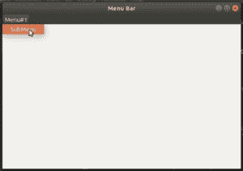

# wxPython–在菜单栏中添加子菜单

> 原文:[https://www . geesforgeks . org/wxpython-add-子菜单-in-menubar/](https://www.geeksforgeeks.org/wxpython-add-sub-menu-in-menubar/)

在本文中，我们将学习如何向菜单栏上的菜单项添加子菜单项。我们可以通过 wxMenuBar 类中的 Append()函数来实现这一点。

> **语法:** wx。菜单栏.追加(自我，菜单，标题)
> **参数:**
> 
> <figure class="table">
> 
> | 参数 | 输入类型 | 描述 |
> | --- | --- | --- |
> | 菜单 | wx 菜单 | 要添加的菜单。调用追加后不要取消分配此菜单。 |
> | 标题 | 线 | 菜单的标题必须是非空的。 |
> 
> </figure>
> 
> **返回:** bool

**代码示例:**

## 蟒蛇 3

```
import wx

class Example(wx.Frame):

    def __init__(self, *args, **kwargs):
        super(Example, self).__init__(*args, **kwargs)

        self.InitUI()

    def InitUI(self):
        # create MenuBar using MenuBar() function
        menubar = wx.MenuBar()
        # add menu to MenuBar
        fileMenu = wx.Menu()
        # add submenu item
        fileItem = fileMenu.Append(20, 'SubMenu')
        menubar.Append(fileMenu, '&Menu# 1')
        self.SetMenuBar(menubar)

        self.SetSize((300, 200))
        self.SetTitle('Menu Bar')
def main():

    app = wx.App()
    ex = Example(None)
    ex.Show()
    app.MainLoop()

if __name__ == '__main__':
    main()
```

**输出:**

