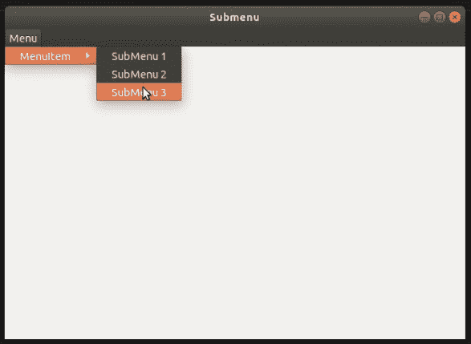

# wxPython–菜单

中的添加子菜单

> 原文:[https://www.geeksforgeeks.org/wxpython-add-submenu-in-menu/](https://www.geeksforgeeks.org/wxpython-add-submenu-in-menu/)

在本文中，我们将学习如何将子菜单添加到菜单栏中的菜单中。在本文中，我们使用 AppendMenu()函数，而不仅仅是使用 Append()。

**步骤:**
**1。**使用菜单栏()构造函数在框架中创建菜单栏。
**2。**向菜单栏添加菜单。
**3。**创建 wx。Menuitem 的菜单。
**4。**使用 ApendMenu()功能添加菜单。

> **语法:**
> 
> ```py
> wx.Menu.AppendMenu(self, id, subMenu, helpString)
> 
> ```
> 
> **追加菜单()的参数:**
> 
> | 参数 | 输入类型 | 描述 |
> | --- | --- | --- |
> | 身份证明（identification） | （同 Internationalorganizations）国际组织 | 菜单项标识符。 |
> | 项目 | 线 | 出现在菜单项上的字符串； |
> | 子菜单 | wx 菜单 | 平面菜单的一个实例，附加的子菜单， |
> | 帮助字符串 | （同 Internationalorganizations）国际组织 | 与项目关联的可选帮助字符串。默认情况下，EVT 事件的处理程序在状态行中显示该字符串。 |

**代码示例:**

```py
import wx

class Example(wx.Frame):

    def __init__(self, *args, **kwargs):
        super(Example, self).__init__(*args, **kwargs)

        self.InitUI()

    def InitUI(self):

        menubar = wx.MenuBar()
        fileMenu = wx.Menu()

        # submenu for menuitem
        imp = wx.Menu()
        imp.Append(wx.ID_ANY, 'SubMenu 1')
        imp.Append(wx.ID_ANY, 'SubMenu 2')
        imp.Append(wx.ID_ANY, 'SubMenu 3')

        # append submenu with menuitem
        fileMenu.AppendMenu(wx.ID_ANY, 'MenuItem', imp)
        menubar.Append(fileMenu, '&Menu')
        self.SetMenuBar(menubar)

        self.SetSize((350, 250))
        self.SetTitle('Submenu')
        self.Centre()

    def OnQuit(self, e):
        self.Close()

def main():

    app = wx.App()
    ex = Example(None)
    ex.Show()
    app.MainLoop()

if __name__ == '__main__':
    main()
```

**输出:**
