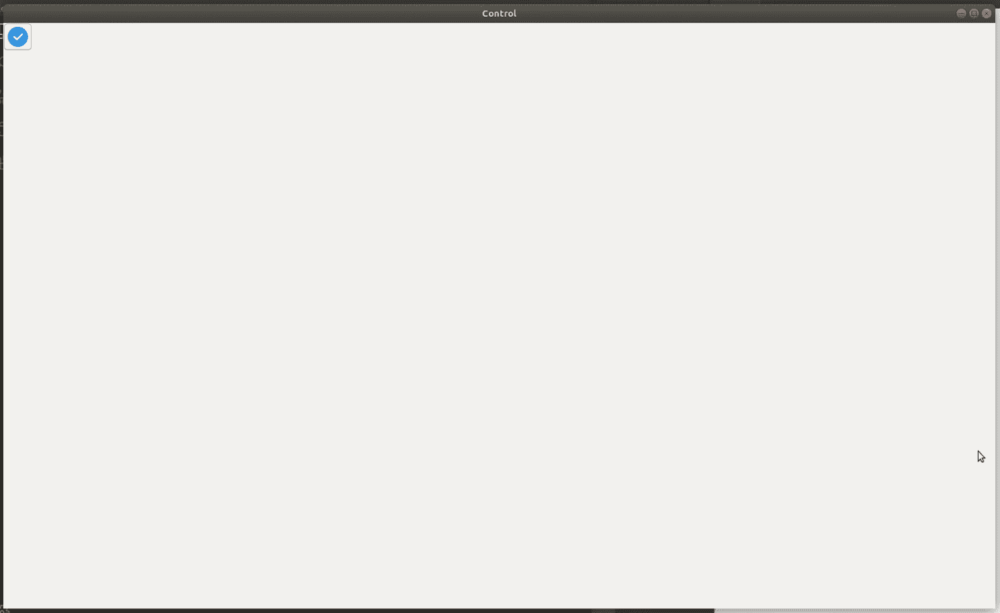

# wx 中的 wxPython–AddControl()方法。工具栏

> 原文:[https://www . geesforgeks . org/wxpython-addcontrol-method-in-wx-toolbar/](https://www.geeksforgeeks.org/wxpython-addcontrol-method-in-wx-toolbar/)

在本文中，我们将学习 wx 中的 AddControl()函数。wxPython 中的工具栏类。AddControl()在工具栏中创建一个控件。控件通常是一个处理用户输入和/或显示一个或多个数据项的小窗口。

> **语法:**
> 
> ```py
> wx.ToolBar.AddControl(self, control, label="")
> 
> ```
> 
> **参数:**
> 
> | 参数 | 输入类型 | 描述 |
> | --- | --- | --- |
> | 控制 | wx。控制 | 要添加的控件。 |
> | 标签 | 线 | 要在控件附近显示的文本。 |
> 
> **返回类型:** wx。工具栏工具库

**代码示例:**

```py
import wx

class Example(wx.Frame):
    global count
    count = 0;
    def __init__(self, *args, **kwargs):
        super(Example, self).__init__(*args, **kwargs)

        self.InitUI()

    def InitUI(self):
        pnl = wx.Panel(self)
        self.toolbar = self.CreateToolBar()

        ctrl = wx.Control(self.toolbar, 21, 
                          wx.DefaultPosition, 
                          wx.DefaultSize, 
                          style = 0, 
                          name = 'control')

        qtool = self.toolbar.AddTool(12, 'Quit', 
                  wx.Bitmap('/home/wxPython/right.png'))

        # Add control using AddControl() method
        rtool = self.toolbar.AddControl(ctrl, 'control')
        self.toolbar.Realize()
        self.SetSize((350, 250))
        self.SetTitle('Simple toolbar')
        self.Centre()

def main():

    app = wx.App()
    ex = Example(None)
    ex.Show()
    app.MainLoop()

if __name__ == '__main__':
    main()
```

**输出:**
