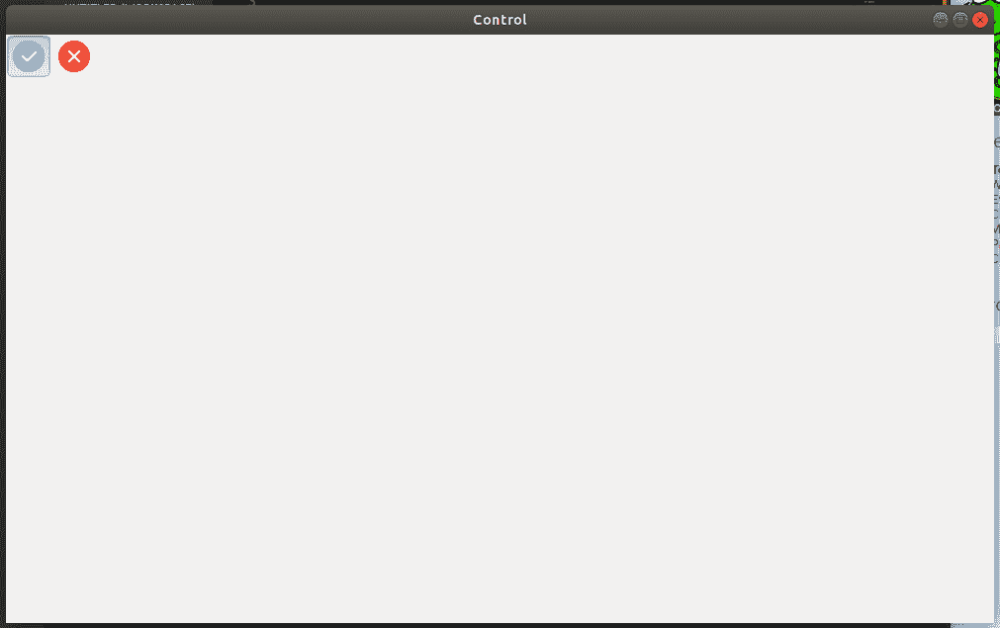
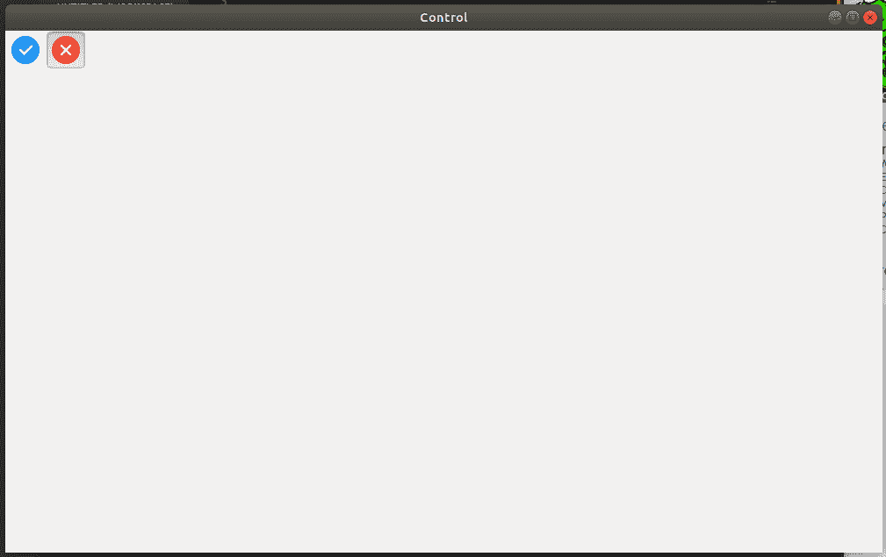

# wx xpython–wx 中的 AddRadioTool()函数。工具栏

> 原文:[https://www . geesforgeks . org/wxpython-addradiotool-function-in-wx-toolbar/](https://www.geeksforgeeks.org/wxpython-addradiotool-function-in-wx-toolbar/)

在这篇特别的文章中，我们将学习在 wx 中使用 AddRadioTool()。wxPython 的工具栏类。AddRadioTool()函数创建一个单选按钮组，这样组中的一个按钮在任何时候都会被按下，换句话说，只要组中的一个按钮被按下，先前按下的按钮就会被自动释放。您应该避免只有一个元素的单选按钮组，因为用户不可能使用这样的按钮。

> **语法:** wx。ToolBar.AddRadioTool(self，toolId，label，bitmap1，bmpDisabled=NullBitmap，shortHelp= "，longHelp= "，clientData=None)
> 
> **参数:**
> 
> | 参数 | 输入类型 | 描述 |
> | --- | --- | --- |
> | 椅子 | （同 Internationalorganizations）国际组织 | 一个整数，通过它可以在后续操作中识别工具。 |
> | 标签 | 线 | 工具要显示的字符串。 |
> | 位图 1 | wx .位图 | 主要工具位图。 |
> | bmpDisabled | wx .位图 | 工具禁用时使用的位图。 |
> | 简短的帮助 | 线 | 该字符串用于工具提示。 |
> | longHelp | 线 | 与工具关联的详细字符串。 |
> | clientdate | 普塞达塔 | 一个指向客户端数据的可选指针，稍后可以使用 GetToolClientData 检索该指针。 |
> 
> **返回类型:** wx。工具栏工具库

**代码示例:**

```py
import wx

class Example(wx.Frame):
    global count
    count = 0;
    def __init__(self, *args, **kwargs):
        super(Example, self).__init__(*args, **kwargs)

        self.InitUI()

    def InitUI(self):
        pnl = wx.Panel(self)
        self.toolbar = self.CreateToolBar()

        # add a radio tool in toolbar
        qtool = self.toolbar.AddRadioTool(12, 'right', wx.Bitmap('/Desktop/wxPython/right.png'),
                                                                        shortHelp ="Radio Tool")
        # another radio tool in radio group
        rtool = self.toolbar.AddRadioTool(13, 'right2', wx.Bitmap('/Desktop/wxPython/wrong.png'),
                                                                         shortHelp ="Radio Tool")

        self.toolbar.Realize()
        self.SetSize((350, 250))
        self.SetTitle('Control')
        self.Centre()

def main():

    app = wx.App()
    ex = Example(None)
    ex.Show()
    app.MainLoop()

if __name__ == '__main__':
    main()
```

**输出:**
*点击*


*点击十字:*
