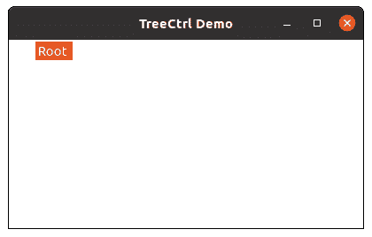

# wx 中的 wxPython–AddRoot()方法。TreeCtrl

> 原文:[https://www . geesforgeks . org/wxpython-addroot-method-in-wx-tree ctrl/](https://www.geeksforgeeks.org/wxpython-addroot-method-in-wx-treectrl/)

在本文中，我们将学习与 wx 相关联的 AddRoot()方法。wxPython 的 TreeCtrl 类。AddRoot()是一个基本方法，用于将根节点添加到树中，返回新项。

图像和选择图像参数是正常图像列表中的一个索引，分别指定要用于未选择和已选择项目的图像。如果图像>-1 且选择图像为-1，则相同的图像用于选定和未选定的项目。

> **语法:** wx。TreeCtrl.AddRoot(self，text，image=-1，selImage=-1，data=None)
> 
> **参数**
> 
> | 参数 | 输入类型 | 描述 |
> | --- | --- | --- |
> | 文本 | 线 | 节点上的文本 |
> | 图像 | （同 Internationalorganizations）国际组织 | image 参数是正常图像列表中的一个索引，分别指定未选择项目的图像。 |
> | selImage | （同 Internationalorganizations）国际组织 | selImage 参数是普通图像列表中的一个索引，分别指定所选项目的图像。 |
> | 数据 | treeitemsata | 根项目的数据。 |

**代码示例:**

```
import wx

class MainFrame(wx.Frame):

    def __init__(self):
        wx.Frame.__init__(self, parent = None, title ='TreeCtrl Demo')
        # tree control
        self.tree = wx.TreeCtrl(self, wx.ID_ANY, wx.DefaultPosition, wx.DefaultSize)

        # add a root node to tree
        self.root = self.tree.AddRoot('Root ')

        # expand tree
        self.tree.Expand(self.root)

        # show frame
        self.Show()

if __name__ == '__main__':
    app = wx.App(redirect = False)
    frame = MainFrame()
    app.MainLoop()
```

**输出窗口:**
