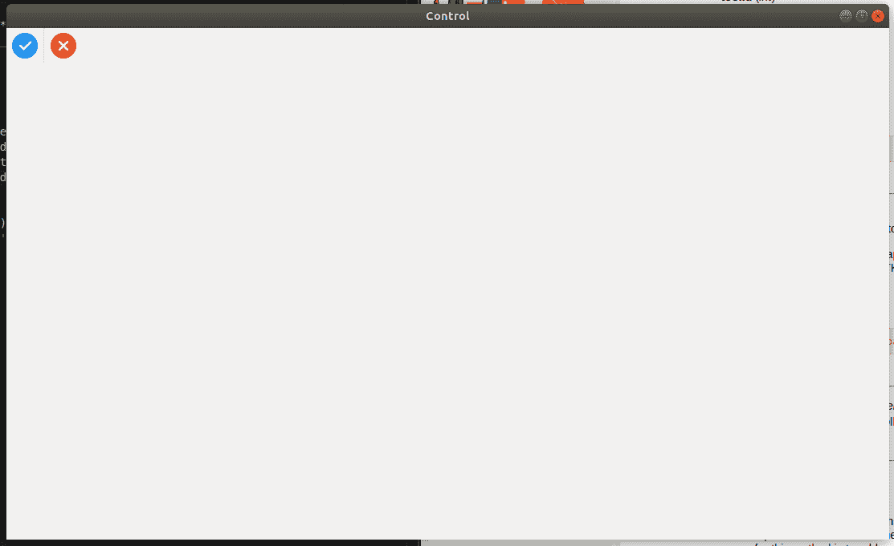

# wx xpython–wx 中的 AddSeparator()方法。工具栏

> 原文:[https://www . geesforgeks . org/wxpython-addseparator-method-in-wx-toolbar/](https://www.geeksforgeeks.org/wxpython-addseparator-method-in-wx-toolbar/)

在本文中，我们将学习 wx 中的 AddSeparator()方法。wxPython 的工具栏类。AddSeparator()是一个非常简单的函数，它创建了一条垂直分隔线 b/w 两个工具或两个无线工具组。请注意，分隔符使用了适合当前平台的外观，因此它可以是垂直线(生活垃圾，GTK 的某些版本)，或者只是一个空格或其他东西。

> **语法:** wx。工具栏。添加分隔符(自身)
> 
> **参数:**AddSeparator()函数中没有参数
> 
> **返回类型:** wx。工具栏工具库

**代码示例:**

```
import wx

class Example(wx.Frame):
    global count
    count = 0;
    def __init__(self, *args, **kwargs):
        super(Example, self).__init__(*args, **kwargs)

        self.InitUI()

    def InitUI(self):
        pnl = wx.Panel(self)
        self.toolbar = self.CreateToolBar()

        qtool = self.toolbar.AddTool(12, 'right', wx.Bitmap('/home/wxPython/right.png'),
                                                                shortHelp ="Radio Tool")
        self.toolbar.AddSeparator()
        rtool = self.toolbar.AddTool(13, 'right2', wx.Bitmap('/home/wxPython/wrong.png'),
                                                                  shortHelp ="Radio Tool")

        self.toolbar.Realize()
        self.SetSize((350, 250))
        self.SetTitle('Control')
        self.Centre()

def main():

    app = wx.App()
    ex = Example(None)
    ex.Show()
    app.MainLoop()

if __name__ == '__main__':
    main()
```

**输出:**
