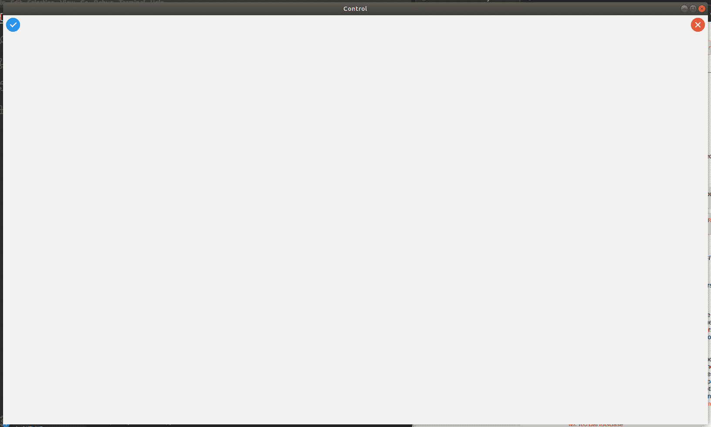

# wx 中的 wxPython | AddStretchableSpace()函数。工具栏

> 原文:[https://www . geesforgeks . org/wxpython-addstractablespace-function-in-wx-toolbar/](https://www.geeksforgeeks.org/wxpython-addstretchablespace-function-in-wx-toolbar/)

在这篇特别的文章中，我们将学习 wx 的`AddStretchableSpace()`函数。wxPython 的工具栏类。`AddStretchableSpace()`在工具栏的工具之间增加一个空格。任何未被固定项目占用的空间(除可拉伸空间之外的所有项目)都以相等的度量分布在工具栏中的可拉伸空间之间。这种方法最常见的用途是在工具栏中应该右对齐的项目之前添加一个可拉伸的空间，但是更多的奇异可能性是可能的，例如，可以在工具栏的开始和结束添加可拉伸的空间，以使所有工具栏项目居中。

> **语法:**
> 
> ```py
> wx.ToolBar.AddStretchableSpace(self)
> 
> ```
> 
> **返回类型:** wx。工具栏工具库

**代码示例:**

```py
import wx

class Example(wx.Frame):
    global count
    count = 0;
    def __init__(self, *args, **kwargs):
        super(Example, self).__init__(*args, **kwargs)

        self.InitUI()

    def InitUI(self):
        pnl = wx.Panel(self)
        self.toolbar = self.CreateToolBar()
        ptool = self.toolbar.AddTool(12, 'left', wx.Bitmap('/home/wxPython/right.png'), 
                                                        shortHelpString ="Simple Tool")

        # Add stretchable space using AddStretchableSpace()
        qtool = self.toolbar.AddStretchableSpace()
        rtool = self.toolbar.AddSimpleTool(12, 'right', wx.Bitmap('/home/wxPython/wrong.png'),
                                                              shortHelpString ="Simple Tool")

        self.toolbar.Realize()
        self.SetSize((350, 250))
        self.SetTitle('Control')
        self.Centre()

def main():

    app = wx.App()
    ex = Example(None)
    ex.Show()
    app.MainLoop()

if __name__ == '__main__':
    main()
```

**输出:**
