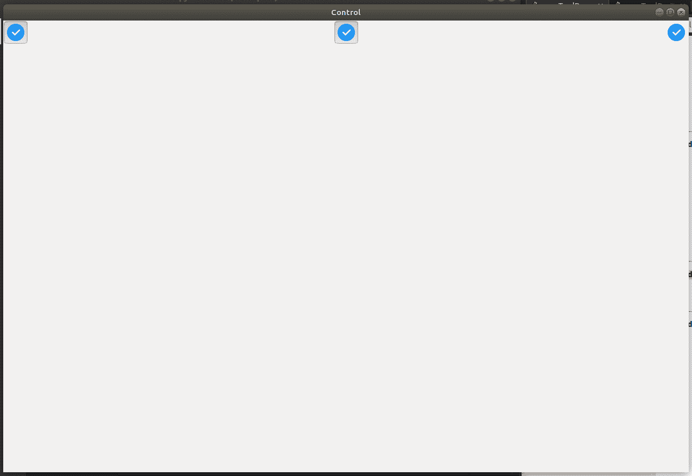

# wx 中的 wxPython–AddTool()函数。工具栏

> 原文:[https://www . geesforgeks . org/wxpython-addtool-function-in-wx-toolbar/](https://www.geeksforgeeks.org/wxpython-addtool-function-in-wx-toolbar/)

AddTool()是 wx 中的另一个函数。wxPython 的工具栏类。AddTool()函数只是向工具栏添加一个工具。这是 AddTool()函数的另一个版本，具有更多的参数。它添加了一些参数，比如:bmpDisabled、longHelp、clientData。

> **语法:** wx。ToolBar.AddTool(self，id，标签，位图，bmpDisabled=wx。NullBitmap，kind=wx。ITEM_NORMAL，shortHelp= "，longHelp= "，clientData=None)
> 
> **参数:**
> 
> | 参数 | 输入类型 | 描述 |
> | --- | --- | --- |
> | 椅子 | （同 Internationalorganizations）国际组织 | 一个整数，通过它可以在后续操作中识别工具。 |
> | 标签 | 线 | 工具要显示的字符串。 |
> | 位图 | wx .位图 | 主要工具位图。 |
> | bmpDisabled | wx .位图 | 工具禁用时使用的位图。 |
> | 种类 | （同 Internationalorganizations）国际组织 | 有点像工具栏。 |
> | 简短的帮助 | 线 | 该字符串用于工具提示。 |
> | longHelp | 线 | 与工具关联的详细字符串。 |
> | clientdate | 普塞达塔 | 一个指向客户端数据的可选指针，稍后可以使用 GetToolClientData 检索该指针。 |

**代码示例:**

```py
import wx

class Example(wx.Frame):
    global count
    count = 0;
    def __init__(self, *args, **kwargs):
        super(Example, self).__init__(*args, **kwargs)

        self.InitUI()

    def InitUI(self):
        pnl = wx.Panel(self)
        self.toolbar = self.CreateToolBar()

        # Radio tool using AddTool() Function
        ptool = self.toolbar.AddTool(12, 'oneTool',  
                                  wx.Bitmap('/home/wxPython/right.png'),
                                  wx.Bitmap('/home/wxPython/wrong.png'), 
                                  kind = wx.ITEM_RADIO, shortHelp ="Simple Tool")

        spc = self.toolbar.AddStretchableSpace()

        # Check tool using AddTool() Function
        qtool = self.toolbar.AddTool(12, 'oneTool',  wx.Bitmap('/home/wxPython/right.png'), 
                                                     wx.Bitmap('/home/wxPython/wrong.png'), 
                                             kind = wx.ITEM_CHECK, shortHelp ="Simple Tool")

        spc = self.toolbar.AddStretchableSpace()
        # Normal tool using AddTool() Function
        rtool = self.toolbar.AddTool(12, 'oneTool',  wx.Bitmap('/home/wxPython/right.png'),
                                                     wx.Bitmap('/home/wxPython/wrong.png'), 
                                           kind = wx.ITEM_NORMAL, shortHelp ="Simple Tool")

        self.toolbar.Realize()
        self.SetSize((350, 250))
        self.SetTitle('Control')
        self.Centre()

def main():

    app = wx.App()
    ex = Example(None)
    ex.Show()
    app.MainLoop()

if __name__ == '__main__':
    main()
```

**输出:**
