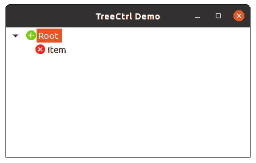

# wx xpython–wx 中的 AssignImageList()方法。TreeCtrl

> 原文:[https://www . geeksforgeeks . org/wxpython-assignimagelist-method-in-wx-tree ctrl/](https://www.geeksforgeeks.org/wxpython-assignimagelist-method-in-wx-treectrl/)

在本文中，我们将学习与 wx 相关联的 AssignImageList()方法。wxPython 的 TreeCtrl 类。赋值图像列表()函数用于设置正常图像列表。用此方法分配的图像列表将被 wx 自动删除。TreeCtrl 视情况而定(即它取得列表的所有权)。
AssignImageList()取 wx。ImageList 参数。

> **语法:** wx。
> **参数**
> 
> <figure class="table">
> 
> | 参数 | 输入类型 | 描述 |
> | --- | --- | --- |
> | 图像列表 | wx。图像列表 | 要分配给树控件的图像列表。 |
> 
> </figure>

**代码示例:**

## 蟒蛇 3

```py
import wx

class MainFrame(wx.Frame):

    def __init__(self):
        wx.Frame.__init__(self, parent = None, title ='TreeCtrl Demo')
        # tree control
        self.tree = wx.TreeCtrl(self, wx.ID_ANY, wx.DefaultPosition, wx.DefaultSize)

        # create imagelist
        il = wx.ImageList(16, 16)

        # add images to image list
        one = il.Add(wx.Image('plus.png', wx.BITMAP_TYPE_PNG).Scale(16, 16).ConvertToBitmap())
        two = il.Add(wx.Image('close.png').Scale(16, 16).ConvertToBitmap())

        # assign image list to tree
        self.tree.AssignImageList(il)

        # add a root node to tree
        self.root = self.tree.AddRoot('Root ', 0)

        # add item to self.root
        self.tree.AppendItem(self.root, "Item", 1)

        # expand tree
        self.tree.Expand(self.root)

        # show frame
        self.Show()

if __name__ == '__main__':
    app = wx.App(redirect = False)
    frame = MainFrame()
    app.MainLoop()
```

**输出窗口:**

