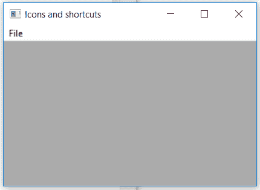

# wxPython–wx 中的 Attach()函数。菜单栏

> 原文:[https://www . geesforgeks . org/wxpython-attach-function-in-wx-menu bar/](https://www.geeksforgeeks.org/wxpython-attach-function-in-wx-menubar/)

在本文中，我们将了解与 wx 相关联的 Detach()函数。wxPython 的菜单栏类。Attach()函数只是将菜单栏与框架连接起来。

Attach()函数只接受一个 wx。框架类型参数。

> **语法:** wx。菜单栏.附加(自我，框架)
> **参数:**
> 
> <figure class="table">
> 
> | 参数 | 输入类型 | 描述 |
> | --- | --- | --- |
> | 设计 | wx。基本框架 | 框架与菜单栏匹配 |
> 
> </figure>

**代码示例:**

## 蟒蛇 3

```
import wx

class Example(wx.Frame):

    def __init__(self, *args, **kwargs):
        super(Example, self).__init__(*args, **kwargs)

        self.InitUI()

    def InitUI(self):

        self.locale = wx.Locale(wx.LANGUAGE_ENGLISH)
        self.menubar = wx.MenuBar()
        self.fileMenu = wx.Menu()

        self.item = wx.MenuItem(self.fileMenu, 1, '&Check',
                                  helpString ="Check Help")
        self.item.SetBitmap(wx.Bitmap('right.png'))

        # SET BLUE COLOUR FOR TEXT FORMAT(R, B, G, A)
        self.item.SetTextColour((79, 81, 230, 255))
        self.fileMenu.Append(self.item)
        self.menubar.Append(self.fileMenu, '&File')

        # Attach menubar to frame
        self.menubar.Attach(self)
        self.SetSize((350, 250))
        self.SetTitle('Icons and shortcuts')
        self.Centre()

def main():
    app = wx.App()
    ex = Example(None)
    ex.Show()
    app.MainLoop()

if __name__ == '__main__':
    main()
```

**输出:**

