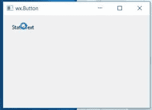

# wx python–wx 中的 CaptureMouse()。静电文本

> 哎哎哎:# t0]https://www . geeksforgeeks . org/wx python-capturemouse-in-wx-static text/

Python 提供了[**【wxpython】**](https://www.geeksforgeeks.org/python-wxpython-module-introduction/)****包**，允许我们创建高功能的图形用户界面。它是 python 的跨平台 GUI 工具包，凤凰版凤凰是改进的下一代 wxPython，它主要关注速度、可维护性和可扩展性。**

**在本文中，我们将了解与 ***wx 相关联的 ***CaptureMouse()*** 方法。wxPython 的*** 类。 ***CaptureMouse()*** 方法当鼠标光标经过 StaticText 时，将鼠标光标转入加载模式。***CaptureMouse()***函数不接受参数。** 

> ****语法:** wx。静态文本。捕获鼠标(自身)**
> 
>  ****参数:** CaptureMouse()方法不接受参数。**

****例:**** 

## **蟒蛇 3**

```
# importing wx library
import wx

# create an Example class
class Example(wx.Frame):

    # constructor
    def __init__(self, *args, **kwargs):
        super(Example, self).__init__(*args, **kwargs)

        # method calling
        self.InitUI()

    # method for user interface creation
    def InitUI(self):
        self.locale = wx.Locale(wx.LANGUAGE_ENGLISH)

        # create parent panel
        self.pnl = wx.Panel(self)

        # create static text at point (20,20)
        self.st = wx.StaticText(self.pnl, id = 1,
                                label = "StaticText",
                                pos = (20,20))

        # capture mouse on static text
        self.st.CaptureMouse()

        self.SetSize((350, 250))
        self.SetTitle('wx.Button')
        self.Centre()

# main function
def main():
  # create an App object
  app = wx.App()

  # create an Example object
  ex = Example(None)
  ex.Show()

  # running a app
  app.MainLoop()

# Driver code
if __name__ == '__main__':

  # main function call
  main()
```

****输出:**** 

**

捕获鼠标输出**