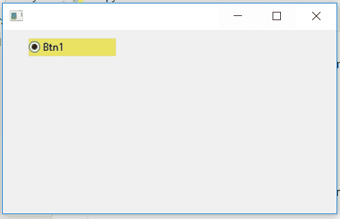

# wxPython–更改单选按钮的背景颜色

> 原文:[https://www . geesforgeks . org/wxpython-change-background-color-of-radio-button/](https://www.geeksforgeeks.org/wxpython-change-background-colour-of-radio-button/)

在这篇文章中，我们将学习如何改变单选按钮的背景颜色。我们将使用 SetBackgroundColour()函数设置窗口的背景颜色。
请注意，与 SetForegroundColour 一样，设置原生控件的背景颜色可能不会影响整个控件，并且可能完全不受支持，具体取决于控件和平台。

> **语法:** wx。
> **参数:**
> 
> <figure class="table">
> 
> | 参数 | 输入类型 | 描述 |
> | --- | --- | --- |
> | 颜色 | wx。颜色 | 静态文本的背景颜色。 |
> 
> </figure>
> 
> **返回类型** bool
> **如果颜色真的改变了，则返回**True；如果颜色已经设置为该颜色，但没有进行任何操作，则返回 False。

**代码示例:**

## 蟒蛇 3

```
import wx

APP_EXIT = 1

class Example(wx.Frame):

    def __init__(self, *args, **kwargs):
        super(Example, self).__init__(*args, **kwargs)

        self.InitUI()

    def InitUI(self):

        # create parent panel for radio buttons
        self.pnl = wx.Panel(self)

        # create radio button in frame
        self.rb1 = wx.RadioButton(self.pnl, label ='Btn1',
                           pos =(30, 10), size =(100, 20))

        # set background colour to yellow (r, g, b, a)
        self.rb1.SetBackgroundColour((233, 227, 100, 255))

def main():
    app = wx.App()
    ex = Example(None)
    ex.Show()
    app.MainLoop()

if __name__ == '__main__':
    main()
```

**输出窗口:**

