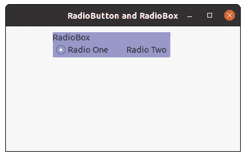

# wxPython–更改收音机盒的背景颜色

> 原文:[https://www . geesforgeks . org/wxpython-change-background-color-of-radio box/](https://www.geeksforgeeks.org/wxpython-change-background-colour-of-radiobox/)

在这篇文章中，我们将学习如何改变框架中无线电盒的背景颜色。为此，我们将使用 SetBackgroundColour()方法。SetBackgroundColour()函数取 wx。将用作无线电盒背景色的颜色参数。

> **语法:** wx。
> **参数**
> 
> <figure class="table">
> 
> | 参数 | 输入类型 | 描述 |
> | --- | --- | --- |
> | 颜色 | wx。颜色 | 用于背景的颜色。 |
> 
> </figure>

**代码示例:**

## 蟒蛇 3

```py
import wx

class FrameUI(wx.Frame):

    def __init__(self, parent, title):
        super(FrameUI, self).__init__(parent, title = title, size =(300, 200))

        # function for in-frame components
        self.InitUI()

    def InitUI(self):
        # parent panel for radio box
        pnl = wx.Panel(self)

        # list of choices
        lblList = ['Radio One', 'Radio Two']

        # create radio box containing above list
        self.rbox = wx.RadioBox(pnl, label ='RadioBox', pos =(80, 10), choices = lblList,
                                         majorDimension = 1, style = wx.RA_SPECIFY_ROWS)

        # change background colour for radio box
        self.rbox.SetBackgroundColour((150, 150, 200, 255))

        # set frame in centre
        self.Centre()
        # set size of frame
        self.SetSize((400, 250))
        # show output frame
        self.Show(True)

# wx App instance
ex = wx.App()
# Example instance
FrameUI(None, 'RadioButton and RadioBox')
ex.MainLoop()
```

**输出窗口:**

