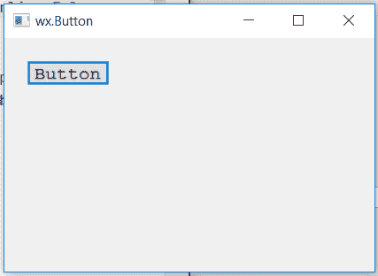

# wxppython–更改按钮标签字体

> 原文:[https://www . geesforgeks . org/wxpython-change-button-label-font/](https://www.geeksforgeeks.org/wxpython-change-button-label-font/)

在本文中，我们将学习如何改变框架中按钮上标签文本的字体。我们需要遵循以下步骤:

> **步骤 1:** 创建一个 wx。字体对象。
> **第二步:**在参数中添加字体的不同属性，如:家族、数据风格等。
> **第三步:**使用 Set font()功能设置字体。

> **语法:** wx。按钮。设置字体(自身，字体)
> 
> **参数:**
> 
> | 参数 | 输入类型 | 描述 |
> | --- | --- | --- |
> | 字体 | wx(地名)。字体(t) | 按钮标签的字体。 |

**代码示例:**

```
import wx

class Example(wx.Frame):

    def __init__(self, *args, **kwargs):
        super(Example, self).__init__(*args, **kwargs)
        self.InitUI()

    def InitUI(self):
        self.locale = wx.Locale(wx.LANGUAGE_ENGLISH)
        self.pnl = wx.Panel(self)
        # wx.Font object initialization
        font = wx.Font(12, wx.FONTFAMILY_MODERN, 0, 90, underline = False,
     faceName ="")

        # CREATE BUTTON AT POINT (20, 20)
        self.st = wx.Button(self.pnl, id = 1, label ="Button", pos =(20, 20),
                                size = wx.DefaultSize,  name ="button")
        # SET FONT FOR LABEL
        self.st.SetFont(font)
        self.SetSize((350, 250))
        self.SetTitle('wx.Button')
        self.Centre()

def main():
    app = wx.App()
    ex = Example(None)
    ex.Show()
    app.MainLoop()

if __name__ == '__main__':
    main()
```

**输出窗口:**
