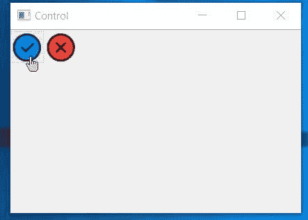

# wxPython–更改工具栏的光标

> 原文:[https://www . geesforgeks . org/wxpython-change-cursor-for-toolbar/](https://www.geeksforgeeks.org/wxpython-change-cursor-for-toolbar/)

在本文中，我们将学习如何将光标悬停在工具栏上时更改为自定义图像光标。为此，我们需要遵循以下步骤。

> **第一步:**创建 wx。您喜欢的图像的图像对象。
> **第二步:**创建 wx。光标对象将图像作为参数传递。
> **第三步:**使用 Set cursor()方法为工具栏设置光标。

> **语法:**
> wx。工具栏。设置光标(自身，光标)
> 
> **参数:**
> 
> | 参数 | 输入类型 | 描述 |
> | --- | --- | --- |
> | 大小 | wx。大小 | 单选按钮的大小 |
> 
> **返回类型:** bool

**代码示例:**

```
import wx

class Example(wx.Frame):
    global count
    count = 0;

    def __init__(self, *args, **kwargs):
        super(Example, self).__init__(*args, **kwargs)

        self.InitUI()

    def InitUI(self):
        self.locale = wx.Locale(wx.LANGUAGE_ENGLISH)
        pnl = wx.Panel(self)
        self.toolbar = self.CreateToolBar()

        # Add tools to toolbar
        ptool = self.toolbar.AddTool(12, 'oneTool',
                                     wx.Bitmap('right.png'),
                                     wx.Bitmap('wrong.png'), shortHelp ="Simple Tool")

        qtool = self.toolbar.AddTool(12, 'oneTool', wx.Bitmap('wrong.png'),
                                     wx.Bitmap('wrong.png'), shortHelp ="Simple Tool")

        # create wx.Image object
        img = wx.Image('click.png')

        # create wx.Cursor object
        crsr = wx.Cursor(img)

        # set crsr cursor for the toolbar
        self.toolbar.SetCursor(crsr)

        self.toolbar.Realize()
        self.SetSize((350, 250))
        self.SetTitle('Control')
        self.Centre()

def main():
    app = wx.App()
    ex = Example(None)
    ex.Show()
    app.MainLoop()

if __name__ == '__main__':
    main()
```

**输出窗口:**
