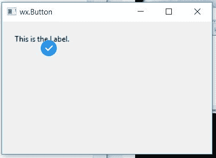

# wxPython–更改静态文本上的光标图像

> 原文:[https://www . geesforgeks . org/wxpython-change-cursor-image-on-static text/](https://www.geeksforgeeks.org/wxpython-change-cursor-image-on-statictext/)

在本文中，我们将学习当光标悬停在静态文本上时，如何更改光标图像。我们可以通过创建一个 cursor 对象并使用与 wx 关联的 SetCursor()函数来实现。wxPython 的 StaticText 类。SetCursor()接受 wx。作为参数的光标对象。

> **语法:** wx。StaticText.SetCursor(游标)
> 
> **参数:**
> 
> | 参数 | 输入类型 | 描述 |
> | --- | --- | --- |
> | 光标 | wx 游标 | 要设置的光标。 |

**代码示例:**

```
import wx

class Example(wx.Frame):

    def __init__(self, *args, **kwargs):
        super(Example, self).__init__(*args, **kwargs)
        self.InitUI()

    def InitUI(self):
        self.locale = wx.Locale(wx.LANGUAGE_ENGLISH)
        self.pnl = wx.Panel(self)

        bmp = wx.Bitmap('right.png')
        # CREATE STATICTEXT AT POINT (20, 20)
        self.st = wx.StaticText(self.pnl, id = 1, label ="This is the Label.", pos =(20, 20),
                                size = wx.DefaultSize, style = wx.ST_ELLIPSIZE_MIDDLE, name ="statictext")

        # CREATE CURSOR OBJECT
        c = wx.Cursor(wx.Image('right.png'))
        # SET c AS CURSOR
        self.st.SetCursor(c)
        self.SetSize((350, 250))
        self.SetTitle('wx.Button')
        self.Centre()

def main():
    app = wx.App()
    ex = Example(None)
    ex.Show()
    app.MainLoop()

if __name__ == '__main__':
    main()
```

**输出窗口:**
