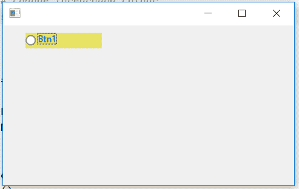

# wxPython–更改单选按钮的字体颜色

> 原文:[https://www . geesforgeks . org/wxpython-change-font-color-of-radio-button/](https://www.geeksforgeeks.org/wxpython-change-font-colour-of-radio-button/)

在本文中，我们将学习如何更改单选按钮的前景或字体颜色。为了改变单选按钮的前景色，我们将使用 SetForegroundColour()函数。函数的作用是:设置窗口的前景色。

前景色的含义因窗户类别而异；它可能是文本颜色或其他颜色，也可能根本不使用。另外，并不是所有的原生控件都支持改变它们的前景色，所以这种方法可能只改变它们的部分颜色，甚至根本不改变。

> **语法:** wx。设置背景色(自身，颜色)
> 
> **参数:**
> 
> | 参数 | 输入类型 | 描述 |
> | --- | --- | --- |
> | 颜色 | wx。颜色 | 背景颜色。 |
> 
> **返回:**如果颜色真的改变了，则为真；如果颜色已经设置为这种颜色，但没有进行任何操作，则为假。
> 
> **返回类型:** bool

**代码示例:**

```py
import wx

APP_EXIT = 1

class Example(wx.Frame):

    def __init__(self, *args, **kwargs):
        super(Example, self).__init__(*args, **kwargs)

        self.InitUI()

    def InitUI(self):

        # create parent panel in the frame
        self.pnl = wx.Panel(self)

        # create radio button at position (30, 10)
        self.rb1 = wx.RadioButton(self.pnl, label ='Btn1', 
                            pos =(30, 10), size =(100, 20))

        # change background colour
        self.rb1.SetBackgroundColour((233, 227, 100, 255))

        # change foreground colour
        self.rb1.SetForegroundColour((0, 0, 255, 255))

def main():
    app = wx.App()
    ex = Example(None)
    ex.Show()
    app.MainLoop()

if __name__ == '__main__':
    main()
```

**输出窗口:**
