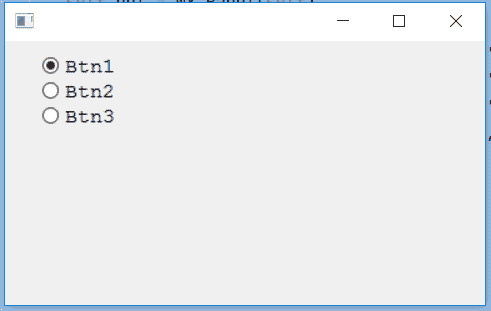

# wxPython–更改单选按钮的字体

> 原文:[https://www . geesforgeks . org/wxpython-change-font-of-radio-button/](https://www.geeksforgeeks.org/wxpython-change-font-of-radio-button/)

在本文中，我们将学习如何更改框架中单选按钮上标签文本的字体。我们需要遵循以下步骤:

> 步骤 1:创建一个 wx。字体对象。
> 第二步:在参数中添加字体的不同属性，如:家族、数据风格等。
> 步骤 3:创建单选按钮。
> 第三步:使用 Set font()函数设置字体。

> **语法:** wx。设置字体(自身，字体)
> 
> **参数:**
> 
> | 参数 | 输入类型 | 描述 |
> | --- | --- | --- |
> | 字体 | wx(地名)。字体(t) | 按钮标签的字体。 |

**代码示例:**

```
import wx

APP_EXIT = 1

class Example(wx.Frame):

    def __init__(self, *args, **kwargs):
        super(Example, self).__init__(*args, **kwargs)

        self.InitUI()

    def InitUI(self):

        # create parent panel for radio buttons
        self.pnl = wx.Panel(self)

        # create radio buttons
        self.rb1 = wx.RadioButton(self.pnl, label ='Btn1', pos =(30, 10), size =(100, 20))
        self.rb2 = wx.RadioButton(self.pnl, label ='Btn2', pos =(30, 30), size =(100, 20))
        self.rb3 = wx.RadioButton(self.pnl, label ='Btn3', pos =(30, 50), size =(100, 20))

        # declare font for radio buttons
        font = wx.Font(12, wx.FONTFAMILY_MODERN, 0, 90, underline = False,
                       faceName ="")

        # set font for all radio buttons
        self.rb1.SetFont(font)
        self.rb2.SetFont(font)
        self.rb3.SetFont(font)

def main():
    app = wx.App()
    ex = Example(None)
    ex.Show()
    app.MainLoop()

if __name__ == '__main__':
    main()
```

**输出窗口:**
