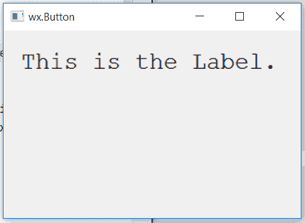

# wxPython–更改静态文本的字体

> 原文:[https://www . geesforgeks . org/wxpython-change-font-of-static text/](https://www.geeksforgeeks.org/wxpython-change-font-of-statictext/)

在这篇文章中，我们将学习如何改变窗口上静态文本的字体。首先，我们将创建一个 wx。wxPython 的字体类。之后我们将使用 wx 的 SetFont()函数。StaticText 类。
SetFont()函数取一个 sing wx。字体类型参数。

> **语法:** wx。StaticText.SetFont(自字体)
> 
> **参数:**
> 
> | 参数 | 输入类型 | 描述 |
> | --- | --- | --- |
> | 字体 | wx(地名)。字体(t) | 静态文本的字体。 |

**代码示例:**

```py
import wx

class Example(wx.Frame):

    def __init__(self, *args, **kwargs):
        super(Example, self).__init__(*args, **kwargs)
        self.InitUI()

    def InitUI(self):
        self.locale = wx.Locale(wx.LANGUAGE_ENGLISH)
        self.pnl = wx.Panel(self)

        # create wx.Font object
        font = wx.Font(20, family = wx.FONTFAMILY_MODERN, style = 0, weight = 90, 
                      underline = False, faceName ="", encoding = wx.FONTENCODING_DEFAULT)

        self.st = wx.StaticText(self.pnl, id = 1, label ="This is the Label.", pos =(20, 20),
                                size = wx.DefaultSize, style = wx.ST_ELLIPSIZE_MIDDLE, name ="statictext")

        # set font for the statictext
        self.st.SetFont(font)

        self.SetSize((350, 250))
        self.SetTitle('wx.Button')
        self.Centre()

def main():
    app = wx.App()
    ex = Example(None)
    ex.Show()
    app.MainLoop()

if __name__ == '__main__':
    main()
```

**输出窗口:**
