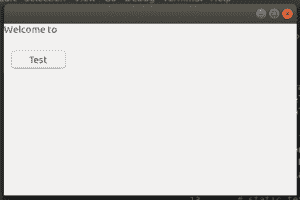
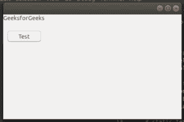

# wxPython–使用按钮

更改标签

> 原文:[https://www . geesforgeks . org/wxpython-change-labels-using-button/](https://www.geeksforgeeks.org/wxpython-change-labels-using-button/)

在本文中，我们将学习如何使按钮与框架互动。在本文中，我们将更改按钮上的文本标签。让我们从步骤开始。

> **步骤 1:** 在框架上创建静态文本。
> **第二步:**添加按钮到框架。
> **第三步:**为按钮创建事件功能。
> **第四步:**在此功能中添加代码更改文本标签。

**代码:**

```
# import wxPython
import wx

class Example(wx.Frame):
    def __init__(self, *args, **kw):
        super(Example, self).__init__(*args, **kw)

        # function to get response after click
        def onButton(event):
            print("Button")
            st.SetLabel("GeeksforGeeks")

        # static text
        st = wx.StaticText(self, label ="Welcome to ")

        # create button
        button = wx.Button(self, wx.ID_ANY, 'Test', (10, 40))

        # bind onButton() function with button
        button.Bind(wx.EVT_BUTTON, onButton)

def main():
    app = wx.App()
    ex = Example(None)
    ex.Show()
    app.MainLoop()

if __name__ == '__main__':
    main()
```

**输出:**
**1。点击前:**


**2。点击**
后