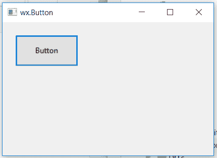

# wxPython–更改按钮尺寸

> 原文:[https://www . geesforgeks . org/wxpython-change-size-of-button/](https://www.geeksforgeeks.org/wxpython-change-size-of-button/)

在本文中，我们将学习与 wx 相关的 SetSize()函数。wxPython 的按钮类。SetSize()函数只是用来改变框架中按钮的大小。SetSize 函数接受 wxSize 参数来更改按钮的大小。

> **语法:** wx。按钮。设置大小(自身，大小)
> 
> **参数:**
> 
> | 参数 | 输入类型 | 描述 |
> | --- | --- | --- |
> | 大小 | wx。大小 | 按钮的大小。 |

**代码示例:**

```py
import wx

class Example(wx.Frame):

    def __init__(self, *args, **kwargs):
        super(Example, self).__init__(*args, **kwargs)
        self.InitUI()

    def InitUI(self):
        self.locale = wx.Locale(wx.LANGUAGE_ENGLISH)

        # create parent panel for button
        self.pnl = wx.Panel(self)

        # create button at point (20, 20)
        self.st = wx.Button(self.pnl, id = 1, label ="Button", pos =(20, 20),
                                          size =(300, 40),  name ="button")

        # change size of button
        self.st.SetSize((100, 50))

        self.SetSize((350, 250))
        self.SetTitle('wx.Button')
        self.Centre()

def main():
    app = wx.App()
    ex = Example(None)
    ex.Show()
    app.MainLoop()

if __name__ == '__main__':
    main()
```

**输出窗口:**
