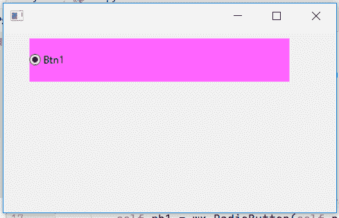

# wxPython–更改单选按钮的大小

> 原文:[https://www . geesforgeks . org/wxpython-更改单选按钮大小/](https://www.geeksforgeeks.org/wxpython-change-size-of-radio-button/)

在本文中，我们将学习更改单选按钮的大小。我们将使用与 wx 关联的 SetSize()函数来更改单选按钮的大小。wxPython 的 RadioButton 类。SetSize()函数只是用来改变单选按钮窗口的大小，以像素为单位。

> **语法:** wx。
> **参数:**
> 
> <figure class="table">
> 
> | 参数 | 输入类型 | 描述 |
> | --- | --- | --- |
> | 大小 | wx。大小 | 单选按钮的大小 |
> 
> </figure>

**代码示例:**

## 蟒蛇 3

```
import wx

APP_EXIT = 1

class Example(wx.Frame):

    def __init__(self, *args, **kwargs):
        super(Example, self).__init__(*args, **kwargs)

        self.InitUI()

    def InitUI(self):
        self.pnl = wx.Panel(self)

        # create radio button at position (30, 10)
        self.rb1 = wx.RadioButton(self.pnl, label ='Btn1',
                             pos =(30, 10), size =(100, 20))

        # change background colour
        self.rb1.SetBackgroundColour((255, 100, 255, 255))

        # change size to (300, 50)
        self.rb1.SetSize((300, 50))

def main():
    app = wx.App()
    ex = Example(None)
    ex.Show()
    app.MainLoop()

if __name__ == '__main__':
    main()
```

**输出窗口:**

