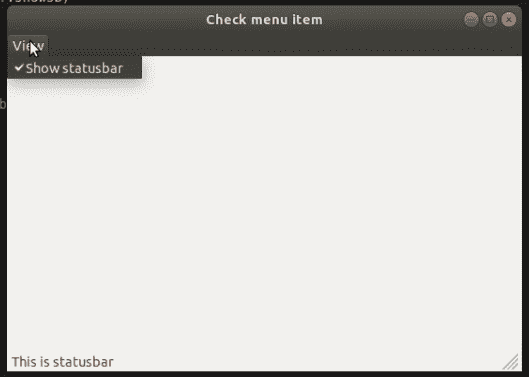
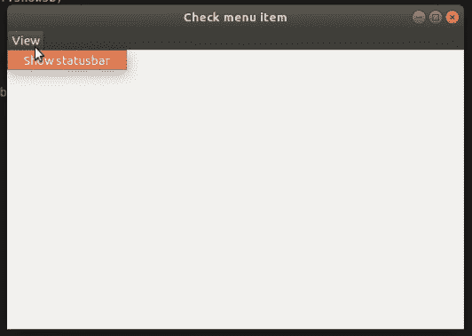

# wxPython–检查菜单

中的项目

> 原文:[https://www . geesforgeks . org/wxpython-check-items-inside-menu/](https://www.geeksforgeeks.org/wxpython-check-items-inside-menu/)

在本文中，我们将学习在菜单栏中检查菜单中的菜单项。我们将使用 Check()函数编写一个代码来显示和隐藏状态栏。

**参数:**

| 参数 | 输入类型 | 描述 |
| --- | --- | --- |
| 身份证明（identification） | （同 Internationalorganizations）国际组织 | 菜单项标识符。 |
| 支票 | 弯曲件 | 如果为真，则将选中该项，否则将取消选中该项。 |

**代码:**

```py
import wx

class Example(wx.Frame):

    def __init__(self, *args, **kwargs):
        super(Example, self).__init__(*args, **kwargs)

        self.InitUI()

    def InitUI(self):

        menubar = wx.MenuBar()
        viewMenu = wx.Menu()

        self.showsb = viewMenu.Append(wx.ID_ANY, 'Show statusbar',
                                                 'Show Statusbar', 
                                            kind = wx.ITEM_CHECK)

        viewMenu.Check(self.showsb.GetId(), True)

        self.Bind(wx.EVT_MENU, self.shStatusBar, self.showsb)

        menubar.Append(viewMenu, '&View')
        self.SetMenuBar(menubar)

        self.statusbar = self.CreateStatusBar()
        self.statusbar.SetStatusText('This is statusbar')

        self.SetSize((450, 350))
        self.SetTitle('Check menu item')
        self.Centre()

    def shStatusBar(self, e):

        if self.showsb.IsChecked():
            self.statusbar.Show()
        else:
            self.statusbar.Hide()

def main():

    app = wx.App()
    ex = Example(None)
    ex.Show()
    app.MainLoop()

if __name__ == '__main__':
    main()
```

**输出:**

*勾选:*

*未勾选:*
