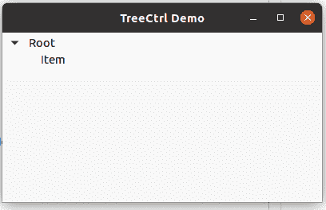

# wx xpython–wx 中的 ClearFocusedItem()方法。TreeCtrl

> 原文:[https://www . geeksforgeeks . org/wxpython-clearfocused item-method-in-wx-tree ctrl/](https://www.geeksforgeeks.org/wxpython-clearfocuseditem-method-in-wx-treectrl/)

在本文中，我们将学习与 wx 相关联的 ClearFocusedItem()方法。wxPython 的 TreeCtrl 类。ClearFocusedItem()是一个简单的方法，用于清除树控件的当前焦点项。

> **语法:** wx。ClearFocusedItem(自身)
> 
> **参数:**clearfocused item()方法不需要任何参数。

**代码示例:**

```
import wx

class Tree(wx.Panel):

    def __init__(self, parent):
        wx.Panel.__init__(self, parent)

        # create Tree Control in frame
        self.tree = wx.TreeCtrl(self, wx.ID_ANY, wx.DefaultPosition,
                                                 wx.DefaultSize,
                                                 wx.TR_HAS_BUTTONS)

        # Create root for Tree Control
        self.root = self.tree.AddRoot('Root')

        # Add item to root
        item = self.tree.AppendItem(self.root, 'Item')

        # Clear focused item
        self.tree.ClearFocusedItem()

        # expand tree
        self.tree.Expand(self.root)

        sizer = wx.BoxSizer(wx.VERTICAL)
        sizer.Add(self.tree, 0, wx.EXPAND)
        self.SetSizer(sizer)

# main root frame for tree control
class rootframe(wx.Frame):
    def __init__(self):
        wx.Frame.__init__(self, parent = None, title ='TreeCtrl Demo')
        panel = Tree(self)
        self.Show()

if __name__ == '__main__':
    app = wx.App(redirect = False)
    frame = rootframe()
    app.MainLoop()
```

**输出窗口:**



树控件中没有聚焦的项目