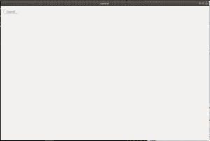

# wx Tyson–wx 中的 ClearTools()函数。工具栏

> 原文:[https://www . geesforgeks . org/wxpython-cleartools-function-in-wx-toolbar/](https://www.geeksforgeeks.org/wxpython-cleartools-function-in-wx-toolbar/)

我们将要学习的 wxPython 系列中的另一个函数是 wx 中的 ClearTools()函数。wxPython 的工具栏类。ClearTools()是 wx.ToolBar 的一个非常基础的函数，ClearTools()函数删除工具栏中的所有工具。

> **语法:** wx。工具栏。清除工具(自身)
> 
> **返回类型:** wx。工具栏工具库

**创建工具栏的代码示例:**

```
import wx

class Example(wx.Frame):
    global count
    count = 0;
    def __init__(self, *args, **kwargs):
        super(Example, self).__init__(*args, **kwargs)

        self.InitUI()

    def InitUI(self):
        pnl = wx.Panel(self)
        self.toolbar = self.CreateToolBar()
        ptool = self.toolbar.AddTool(12, 'oneTool',  wx.Bitmap('/home/wxPython/right.png'), shortHelp ="Simple Tool")
        qtool = self.toolbar.AddTool(12, 'oneTool',  wx.Bitmap('/home/wxPython/right.png'),  shortHelp ="Simple Tool")
        rtool = self.toolbar.AddTool(12, 'oneTool',  wx.Bitmap('/home/wxPython/right.png'),  shortHelp ="Simple Tool")
        self.btn = wx.Button(pnl, label ='Clear Tools', pos =(20, 20))

        self.btn.Bind(wx.EVT_BUTTON, self.Onclick)
        self.toolbar.Realize()
        self.SetSize((350, 250))
        self.SetTitle('Control')
        self.Centre()

    def Onclick(self, e):
        # clear tools using ClearTools() function
        self.toolbar.ClearTools()
        self.btn.SetLabel("Cleared")

def main():

    app = wx.App()
    ex = Example(None)
    ex.Show()
    app.MainLoop()

if __name__ == '__main__':
    main()
```

**输出:**
*开启启动窗口:*


*点击按钮:*
