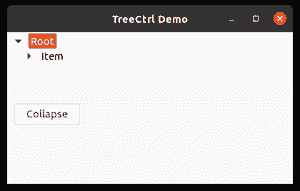
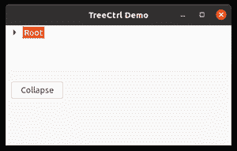

# wx Tyson–wx 中的 CollapseAll()方法。TreeCtrl

> 原文:[https://www . geesforgeks . org/wxpython-collapseall-method-in-wx-tree ctrl/](https://www.geeksforgeeks.org/wxpython-collapseall-method-in-wx-treectrl/)

在这篇特别的文章中，我们将学习与 wx 相关的 CollapseAll()方法。wxPython 的 TreeCtrl 类。collapseal()方法类似于 collapseal()方法，但是 collapseal()方法只折叠给定的项，而 collapseal()方法折叠根项。
collapseal()方法不需要参数。

> **语法:**
> wx。treectrl . collapseall(自我)
> 
> **参数:**
> collapseal()方法不需要参数。

**代码示例:**

## 蟒蛇 3

```
import wx

class MyTree(wx.TreeCtrl):

    def __init__(self, parent, id, pos, size, style):
        wx.TreeCtrl.__init__(self, parent, id, pos, size, style)

class TreePanel(wx.Panel):

    def __init__(self, parent):
        wx.Panel.__init__(self, parent)

        # create Tree Control
        self.tree = MyTree(self, wx.ID_ANY, wx.DefaultPosition, (100, 70),
                           wx.TR_HAS_BUTTONS)

        # Add root to Tree Control
        self.root = self.tree.AddRoot('Something goes here')

        # Add item to root
        itm = self.tree.AppendItem(self.root, 'Operating Systems')

        # Add item to 'itm'
        self.tree.AppendItem(itm, "Sub Item")

        # Expand whole tree
        self.tree.Expand(self.root)

        sizer = wx.BoxSizer(wx.VERTICAL)
        sizer.Add(self.tree, 0, wx.EXPAND)
        self.SetSizer(sizer)

        # Add button in frame
        self.btn = wx.Button(self, 1, "Collapse", (10, 100))
        # Bind event function with button
        self.btn.Bind(wx.EVT_BUTTON, self.onclick)

    def onclick(self, e):
        # Collapse root of tree
        self.tree.CollapseAll()

class MainFrame(wx.Frame):

    def __init__(self):
        wx.Frame.__init__(self, parent=None, title='TreeCtrl Demo')
        panel = TreePanel(self)
        self.Show()

if __name__ == '__main__':
    app = wx.App(redirect=False)
    frame = MainFrame()
    app.MainLoop()
```

**输出窗口:**



单击按钮前



点击按钮后