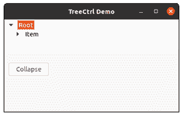

# wx xpython–wx 中的 CollapseAllChildren()方法。TreeCtrl

> 原文:[https://www . geesforgeks . org/wxpython-collapseallchilders-method-in-wx-tree ctrl/](https://www.geeksforgeeks.org/wxpython-collapseallchildren-method-in-wx-treectrl/)

在本文中，我们将学习与 wx 相关联的 CollapseAllChildren()方法。wxPython 的 TreeCtrl 类。CollapseAllChildren()方法是一个简单的方法，用于递归地折叠特定项及其所有子项。

CollapseAllChildren()方法将 TreeItemId 作为参数。

> **语法:** wx。集体儿童(自我，项目)
> 
> **参数:**
> 
> <figure class="table">
> 
> | 参数 | 类型 | 描述 |
> | 项目 | wx(地名)。TreeItemId(树项目 Id) | 我们要递归折叠的树项目及其所有子项目的项目标识。 |
> 
> </figure>

**代码示例:**

## 计算机编程语言

```
import wx

class MyTree(wx.TreeCtrl):

    def __init__(self, parent, id, pos, size, style):
        wx.TreeCtrl.__init__(self, parent, id, pos, size, style)

class TreePanel(wx.Panel):

    def __init__(self, parent):
        wx.Panel.__init__(self, parent)

        # create Tree Control
        self.tree = MyTree(self, wx.ID_ANY, wx.DefaultPosition,
                                  (100,70), wx.TR_HAS_BUTTONS)

        # Add root to Tree Control
        self.root = self.tree.AddRoot('Root')

        # Add item to root
        self.itm = self.tree.AppendItem(self.root, 'Item')

        # Add item to 'itm'
        self.itm2 = self.tree.AppendItem(self.itm, "Sub Item")

        # Add child item to itm2
        self.itm3 = self.tree.AppendItem(self.itm2, "Another Item")

        # Expand whole tree
        self.tree.Expand(self.root)

        sizer = wx.BoxSizer(wx.VERTICAL)
        sizer.Add(self.tree, 0, wx.EXPAND)
        self.SetSizer(sizer)

        # Add button in frame
        self.btn = wx.Button(self, 1, "Collapse", (10,100))
        # Bind event function with button
        self.btn.Bind(wx.EVT_BUTTON, self.onclick)

    def onclick(self, e):
        # collapse all children of itm recursively
        self.tree.CollapseAllChildren(self.itm)

class MainFrame(wx.Frame):

    def __init__(self):
        wx.Frame.__init__(self, parent=None,
                      title='TreeCtrl Demo')
        panel = TreePanel(self)
        self.Show()

if __name__ == '__main__':
    app = wx.App(redirect=False)
    frame = MainFrame()
    app.MainLoop()
```

**输出:**

