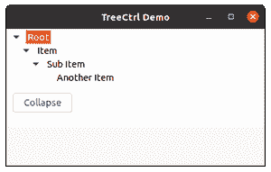
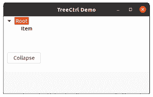

# wx xpython–wx 中的 CollapseAndReset()方法。TreeCtrl

> 原文:[https://www . geesforgeks . org/wxpython-collapsandreset-method-in-wx-tree ctrl/](https://www.geeksforgeeks.org/wxpython-collapseandreset-method-in-wx-treectrl/)

在本文中，我们将了解 wxPython 中的另一个函数，即与 wx 关联的 CollapseAndReset()方法。wxPython 的 TreeCtrl 类。CollapseAndReset()函数只是折叠一个特定的项目并移除它的所有子项目。

它以 TreeItemId 为参数。

> **语法:** wx。TreeCtrl.CollapseAndReset(自我、项目)

**代码示例:**

## 计算机编程语言

```
import wx

class MyTree(wx.TreeCtrl):

    def __init__(self, parent, id, pos, size, style):
        wx.TreeCtrl.__init__(self, parent, id, pos, size, style)

class TreePanel(wx.Panel):

    def __init__(self, parent):
        wx.Panel.__init__(self, parent)

        # create Tree Control
        self.tree = MyTree(self, wx.ID_ANY, wx.DefaultPosition,
                                 (150,150), wx.TR_HAS_BUTTONS)

        # Add root to Tree Control
        self.root = self.tree.AddRoot('Root')

        # Add item to root
        self.itm = self.tree.AppendItem(self.root, 'Item')

        # Add item to 'itm'
        self.itm2 = self.tree.AppendItem(self.itm, "Sub Item")

        # Add child item to itm2
        self.itm3 = self.tree.AppendItem(self.itm2, "Another Item")

        # Expand whole tree
        self.tree.ExpandAll()

        sizer = wx.BoxSizer(wx.VERTICAL)
        sizer.Add(self.tree, 0, wx.EXPAND)
        self.SetSizer(sizer)

        # Add button in frame
        self.btn = wx.Button(self, 1, "Collapse", (10,100))
        # Bind event function with button
        self.btn.Bind(wx.EVT_BUTTON, self.onclick)

    def onclick(self, e):
        # collapse all children of itm recursively
        self.tree.CollapseAndReset(self.itm)

class MainFrame(wx.Frame):

    def __init__(self):
        wx.Frame.__init__(self, parent=None, 
                      title='TreeCtrl Demo')
        panel = TreePanel(self)
        self.Show()

if __name__ == '__main__':
    app = wx.App(redirect=False)
    frame = MainFrame()
    app.MainLoop()
```

**输出:**



单击按钮前



点击按钮后