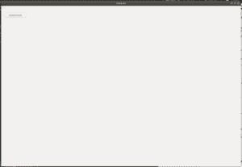

# wxPython |使用 CreateTool()函数创建控制工具

> 原文:[https://www . geesforgeks . org/wxpython-create-control-tool-using-create tool-function/](https://www.geeksforgeeks.org/wxpython-create-control-tool-using-createtool-function/)

在这个函数中，我们将学习如何使用 CreateTool()函数创建一个控制工具。这是 CreateTool()函数的另一个版本，它只接受两个参数，即控制和标签。让我们详细看看参数。

**参数:**

<figure class="table">

| 参数 | 输入类型 | 描述 |
| --- | --- | --- |
| 控制 | wx。控制 | 将添加控件。 |
| 标签 | 线 | 要在控件附近显示的文本。 |

</figure>

**语法:**

```py
wx.ToolBar.CreateTool(self, control, label)
```

**代码示例:**

## 蟒蛇 3

```py
import wx

class Example(wx.Frame):
    global count
    count = 0;
    def __init__(self, *args, **kwargs):
        super(Example, self).__init__(*args, **kwargs)

        self.InitUI()

    def InitUI(self):
        pnl = wx.Panel(self)
        self.toolbar = self.CreateToolBar()
        # declare control
        ctrl = wx.Control(self.toolbar, id = 19, pos = wx.DefaultPosition, size = wx.DefaultSize, style = 0, name ='control')
        # create control tool
        self.ptool = self.toolbar.CreateTool(ctrl, "control")
        self.btn = wx.Button(pnl, label ='Add created tool', pos =(20, 20))

        self.btn.Bind(wx.EVT_BUTTON, self.Onclick)
        self.toolbar.Realize()
        self.SetSize((350, 250))
        self.SetTitle('Control')
        self.Centre()

    def Onclick(self, e):
        # Add control tool
        self.toolbar.AddTool(self.ptool)
        self.btn.SetLabel("Added tool")

def main():

    app = wx.App()
    ex = Example(None)
    ex.Show()
    app.MainLoop()

if __name__ == '__main__':
    main()
```

**输出:**
*启动时应用:*


*点击按钮:*

