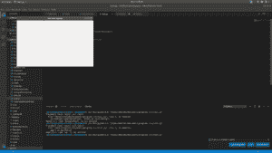

# wxPython–创建空窗口

> 原文:[https://www.geeksforgeeks.org/wxpython-create-empty-window/](https://www.geeksforgeeks.org/wxpython-create-empty-window/)

**wxPython** 是 Python 中最著名的构建 GUI 应用程序的库之一。在 wxPython 的第一篇文章中，我们将使用 wxPython 库构建一个空窗口。

> 创建空窗口的步骤:
> 
> 1.在你的代码
> 2 中导入 wx。Creare wx。App 对象
> 3。为 wx 创建对象。框架
> 4。使用 Show()函数显示框架

```py
# Import wx module
import wx

# Create a new app
app = wx.App(False)

# A Frame is a top-level window.# Create a new app
app = wx.App(False)

# A Frame is a top-level window.
frame = wx.Frame(None, wx.ID_ANY, "GeeksforGeeks")

# Show the frame.
frame.Show(True) 
# Handle events using MainLoop() function    
app.MainLoop()

frame = wx.Frame(None, wx.ID_ANY, "GeeksforGeeks")

# Show the frame.
frame.Show(True) 

# Handle events using MainLoop() function    
app.MainLoop()
```

当你运行这个程序的时候，一个新的空窗口会出现在你的屏幕上，标签是 GeeksforGeeks。
**输出:**
