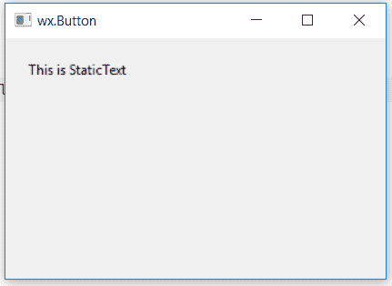

# wxPython–wx 中的 Create()函数。StaticText

> 原文:[https://www . geesforgeks . org/wxpython-create-function-in-wx-static text/](https://www.geeksforgeeks.org/wxpython-create-function-in-wx-statictext/)

在本文中，我们将了解与 wx 相关联的 Create()。wxPython 的 StaticText 类。静态文本控件显示一行或多行只读文本。

Create()函数用于静态文本的两步创建。我将 statictext 的属性作为参数。

> **语法:** wx。StaticText.Create(父级，id=ID_ANY，label= "，pos=DefaultPosition，size=DefaultSize，style=0，name=StaticTextNameStr)
> 
> **参数:**
> 
> | 参数 | 输入类型 | 描述 |
> | --- | --- | --- |
> | 父母 | wx。窗户 | 父窗口。不应该是无。 |
> | 身份证明（identification） | wx。窗户 | 父窗口。不应该是无。 |
> | 父母 | wx.窗口标识 | 控件标识符。值-1 表示默认值。 |
> | 标签 | 线 | 标示文字。 |
> | 刷卡机 | wx。要点 | 窗口位置。 |
> | 大小 | wx。大小 | 窗口大小。 |
> | 风格 | 长的 | 窗口样式。 |
> | 名字 | 线 | 窗口名称。 |
> 
> **返回类型:**
> 布尔

**代码示例:**

```py
import wx

class Example(wx.Frame):

    def __init__(self, *args, **kwargs):
        super(Example, self).__init__(*args, **kwargs)
        self.InitUI()

    def InitUI(self):
        self.locale = wx.Locale(wx.LANGUAGE_ENGLISH)
        self.pnl = wx.Panel(self)
        bmp = wx.Bitmap('right.png')

        self.st = wx.StaticText()
        # CREATE STATICTEXT AT POINT (20, 20) USING Create() FUNCTION
        self.st.Create(self.pnl, id = 1, label ="This is StaticText", pos =(20, 20),
                                size = wx.DefaultSize, style = 0, name ="statictext")

        self.SetSize((350, 250))
        self.SetTitle('wx.Button')
        self.Centre()

def main():
    app = wx.App()
    ex = Example(None)
    ex.Show()
    app.MainLoop()

if __name__ == '__main__':
    main()
```

**输出窗口:**
