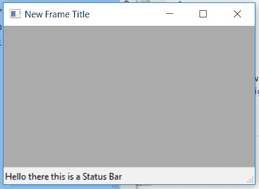

# wxPython–wx 中的 Create()函数。状态栏

> 原文:[https://www . geesforgeks . org/wxpython-create-function-in-wx-status bar/](https://www.geeksforgeeks.org/wxpython-create-function-in-wx-statusbar/)

在本文中，我们将学习与 wx 相关联的 Create()函数。wxPython 的 StatusBar 类。与 StatusBar()构造函数类似，Create 用于向状态栏添加属性，前提是应该使用 status bar()构造函数初始化状态栏变量，而不使用任何参数。

Create 将状态栏的属性作为参数。

> **语法:** wx。StatusBar.Create(self，parent，id=ID_ANY，style=STB_DEFAULT_STYLE，name=StatusBarNameStr)
> **参数:**
> 
> <figure class="table">
> 
> | 参数 | 输入类型 | 描述 |
> | --- | --- | --- |
> | 父母 | wx。基本框架 | 要附加状态栏的父框架。 |
> | 身份证明（identification） | （同 Internationalorganizations）国际组织 | 用于状态栏的标识符。 |
> | 风格 | 长的 | 状态栏的样式。 |
> | 名字 | 线 | 与 statusbar 关联的名称。 |
> 
> </figure>

**代码示例:**

## 蟒蛇 3

```
import wx

class Example(wx.Frame):

    def __init__(self, *args, **kwargs):
        super(Example, self).__init__(*args, **kwargs)

        self.InitUI()

    def InitUI(self):

        self.locale = wx.Locale(wx.LANGUAGE_ENGLISH)
        # INITIALIZE USING EMPTY CONSTRUCTOR
        self.statusbar = wx.StatusBar()
        # CREATE STATUS BAR USING CREATE FUNCTION
        self.statusbar.Create(self, id = 1, style = wx.STB_DEFAULT_STYLE,
                                                      name = "Status Bar")
        self.statusbar.SetStatusText("Hello there this is a Status Bar")
        self.SetStatusBar(self.statusbar)
        self.SetSize((350, 250))
        self.SetTitle('New Frame Title')
        self.Centre()

def main():
    app = wx.App()
    ex = Example(None)
    ex.Show()
    app.MainLoop()

if __name__ == '__main__':
    main()
```

**输出窗口:**

