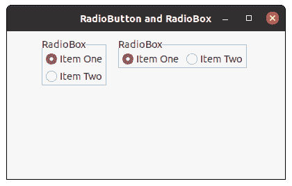

# wxPython–创建带有不同方向项目的无线电盒

> 原文:[https://www . geesforgeks . org/wxpython-create-radio-box-with-items-in-differential-orientation/](https://www.geeksforgeeks.org/wxpython-create-radio-box-with-items-in-different-orientation/)

在这篇文章中，我们将学习如何创建一个带有水平和垂直方向项目的无线电盒。为了做到这一点，我们将在创建无线电盒时使用样式参数。

收音机盒子里有两种款式。

*   **wx。RA_SPECIFY_ROWS:** 主要维度参数是指最大行数。
*   **wx。RA_SPECIFY_COLS:** 主维度参数是指最大列数。

> **语法:**
> wx。RadioBox.RadioBox(父级，id=ID_ANY，label= "，pos=DefaultPosition，
> size=DefaultSize，choices=[]，majorDimension=0，style=RA_SPECIFY_ROWS，
> class = " noidbendiv "，
> validator=DefaultValidator，name=RadioBoxNameStr)
> 
> *   要设置垂直方向，我们将使用 wx。RA_SPECIFY_ROWS
> *   要设置每行的项目数，我们将使用 majorDimension 参数。
> *   要设置水平方向，我们将使用 wx。RA_SPECIFY_COLS
> *   要设置每列的项数，我们将使用 majorDimension 参数。

**代码示例:**

## 蟒蛇 3

```
import wx

class FrameUI(wx.Frame):

    def __init__(self, parent, title):
        super(FrameUI, self).__init__(parent, title = title, size =(300, 200))

        # function for in-frame components
        self.InitUI()

    def InitUI(self):
        # parent panel for radio box
        pnl = wx.Panel(self)

        # list of choices
        hlist = ['Item One', 'Item Two']
        vlist =['Item One', 'Item Two']

        # create radio box with items in horizontal orientation
        self.rbox = wx.RadioBox(pnl, label ='RadioBox', pos =(10, 10), choices = hlist,
                                majorDimension = 0, style = wx.RA_SPECIFY_ROWS)

        # create radio box with items in vertical orientation
        self.rbox = wx.RadioBox(pnl, label ='RadioBox', pos =(240, 10), choices = vlist,
                                majorDimension = 0, style = wx.RA_SPECIFY_COLS)
        # set frame in centre
        self.Centre()
        # set size of frame
        self.SetSize((400, 250))
        # show output frame
        self.Show(True)

# wx App instance
ex = wx.App()
# Example instance
FrameUI(None, 'RadioButton and RadioBox')
ex.MainLoop()
```

**输出窗口:**

