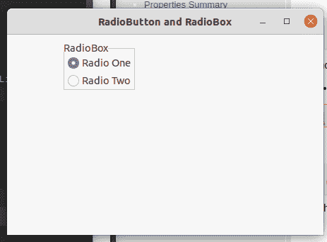

# wxPython–通过两步创建创建无线电盒

> 原文:[https://www . geesforgeks . org/wxpython-create-radio-box-with-two-step-creation/](https://www.geeksforgeeks.org/wxpython-create-radio-box-with-two-step-creation/)

在本文中，我们将学习如何在框架中创建一个无线电盒。单选按钮用于选择多个互斥选项中的一个。它显示为带标签按钮的垂直列或水平行。

为了创建无线电盒，我们将在 wx 中使用 create()函数。wxPython 的 RadioBox 类。Create()函数以无线电盒的不同属性为参数。

> **语法:**
> wx。RadioBox.Create( parent，id=ID_ANY，label= "，pos=DefaultPosition，
> size=DefaultSize，choice =[]，majorDimension=0，style=RA_SPECIFY_COLS，
> validator=DefaultValidator，name=RadioBoxNameStr)
> 
> **参数:**
> 
> | 参数 | 输入类型 | 描述 |
> | --- | --- | --- |
> | 父母 | wx。窗户 | 父窗口。不应该是无。 |
> | 身份证明（identification） | wx.窗口标识 | 控件标识符。值-1 表示默认值。 |
> | 标签 | 线 | 标示文字。 |
> | 刷卡机 | wx。要点 | 窗口位置。 |
> | 大小 | wx。窗户 | 窗口大小。 |
> | 选择 | 字符串列表 | 窗口样式。 |
> | 主要维度 | （同 Internationalorganizations）国际组织 | 指定二维 radiobox 的最大行数(如果样式包含 RA_SPECIFY_ROWS)或最大列数(如果样式包含 RA_SPECIFY_COLS)。默认值 0 表示使用项目数，即选项中的元素数。 |
> | 风格 | 长的 | 用来初始化 radiobox 的选项数组。 |
> | 验证器 | wx。验证器 | 窗口验证器。 |
> | 名字 | 线 | 窗口名称。 |

**代码示例:**

```py
import wx

class FrameUI(wx.Frame):

    def __init__(self, parent, title):
        super(FrameUI, self).__init__(parent, title = title, size =(300, 200))

        # function for in-frame components
        self.InitUI()

    def InitUI(self):
        # parent panel for radio box
        pnl = wx.Panel(self)

        # list of choices
        lblList = ['Value X', 'Value Y', 'Value Z']

        # create radio box
        self.rbox = wx.RadioBox()

        # create with two step creation using Create() function
        self.rbox.Create(pnl, label ='RadioBox', pos =(80, 10), choices = lblList,
                              majorDimension = 1, style = wx.RA_SPECIFY_ROWS)
        # set frame in centre
        self.Centre()
        # set size of frame
        self.SetSize((400, 250))
        # show output frame
        self.Show(True)

# wx App instance
ex = wx.App()
# Example instance
FrameUI(None, 'RadioButton and RadioBox')
ex.MainLoop()
```

**输出窗口:**
