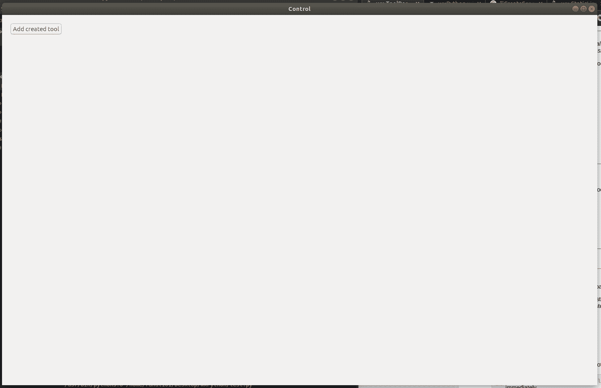
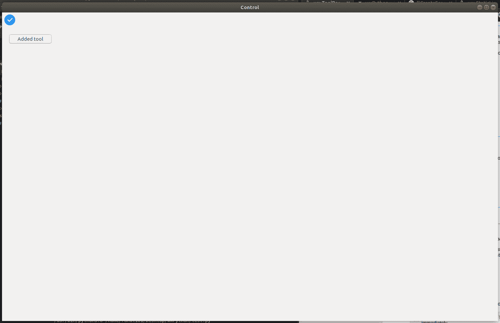

# wx 中的 wxPython | CreateTool()函数。工具栏

> 原文:[https://www . geesforgeks . org/wxpython-createtool-function-in-wx-toolbar/](https://www.geeksforgeeks.org/wxpython-createtool-function-in-wx-toolbar/)

在这篇特别的文章中，我们将学习 wx 中的 CreateTool()函数。wxPython 中的工具栏类。CreateTool()函数是一个创建新工具栏工具的工厂函数。CreateTool()函数只创建一个工具，该工具是使用 AddTool()函数进一步添加的。

> **语法:**
> wx。ToolBar.CreateTool(self，id，标签，位图，bmpDisabled=wx。NullBitmap，kind=wx。ITEM_NORMAL，clientData =无，shortHelp= "，" longHelp= " "
> 
> **参数:**
> 
> | 参数 | 输入类型 | 描述 |
> | --- | --- | --- |
> | 椅子 | （同 Internationalorganizations）国际组织 | 一个整数，通过它可以在后续操作中识别工具。 |
> | 标签 | 线 | 工具要显示的字符串。 |
> | bmpNormal | wx .位图 | 主要工具位图。 |
> | bmpDisabled | wx .位图 | 工具禁用时使用的位图。 |
> | 种类 | （同 Internationalorganizations）国际组织 | 有点像工具栏。 |
> | clientdate | 普塞达塔 | 一个指向客户端数据的可选指针，稍后可以使用 GetToolClientData 检索该指针。 |
> | 简短的帮助 | 线 | 该字符串用于工具提示。 |
> | longHelp | 线 | 与工具关联的详细字符串。 |

**示例:**

```py
import wx

class Example(wx.Frame):
    global count
    count = 0;
    def __init__(self, *args, **kwargs):
        super(Example, self).__init__(*args, **kwargs)

        self.InitUI()

    def InitUI(self):
        pnl = wx.Panel(self)
        self.toolbar = self.CreateToolBar()
        # create a tool using CreateTool() function
        self.ptool = self.toolbar.CreateTool(12,
                                             'oneTool',
                                             wx.Bitmap('path / wxPython / right.png'),
                                             shortHelp ="Simple Tool")

        self.btn = wx.Button(pnl, label ='Add created tool', pos =(20, 20))

        self.btn.Bind(wx.EVT_BUTTON, self.Onclick)
        self.toolbar.Realize()
        self.SetSize((350, 250))
        self.SetTitle('Control')
        self.Centre()

    def Onclick(self, e):
        # Add toolbar tool using AddTool() function
        self.toolbar.AddTool(self.ptool)
        self.btn.SetLabel("Added tool")

def main():

    app = wx.App()
    ex = Example(None)
    ex.Show()
    app.MainLoop()

if __name__ == '__main__':
    main()
```

**输出:**
*启动时应用:*


*点击按钮:*
