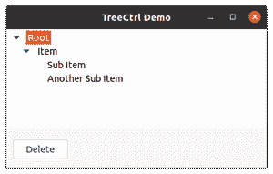
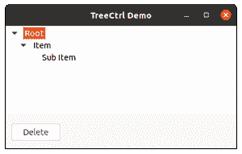

# wx Tyson–wx 中的 Delete()方法。TreeCtrl

> 原文:[https://www . geesforgeks . org/wxpython-delete-method-in-wx-tree ctrl/](https://www.geeksforgeeks.org/wxpython-delete-method-in-wx-treectrl/)

在本文中，我们将学习与类 wx 相关联的 Delete()方法。wxPython 的 TreeCtrl。Delete()函数只是用来从树中删除特定的项目，它可以是根项目或终端项目。

将生成一个 EVT 树删除项目事件。

该函数可能会导致对 GetNextChild 的后续调用失败。

> **语法:**
> 
> wx(地名)。TreeCtrl.Delete(自我、项目)
> 
> **参数:**
> 
> <figure class="table">
> 
> | 参数 | 类型 | 描述 |
> | 项目 | wx(地名)。TreeItemId(树项目 Id) | 我们希望从树控件中删除的项目 |
> 
> </figure>

**代码示例:**

## 计算机编程语言

```py
import wx

class TreePanel(wx.Panel):

    def __init__(self, parent):
        wx.Panel.__init__(self, parent)

        # initialize Tree Control
        self.tree = wx.TreeCtrl(self, wx.ID_ANY, wx.DefaultPosition, (100, 150),
                                                 wx.TR_HAS_BUTTONS)

        # create Tree Control using Create() method
        self.tree.Create
        # Add root to Tree Control
        self.root = self.tree.AddRoot('Root')

        # Add item to root
        self.itm = self.tree.AppendItem(self.root, 'Item')

        # Add item to 'itm'
        self.si1 = self.tree.AppendItem(self.itm, "Sub Item")

        # Add another item
        self.si2 = self.tree.AppendItem(self.itm, "Another Sub Item")

        # Expand whole tree
        self.tree.ExpandAll()

        sizer = wx.BoxSizer(wx.VERTICAL)
        sizer.Add(self.tree, 0, wx.EXPAND)
        self.SetSizer(sizer)

        # Add button in frame
        self.btn = wx.Button(self, 1, "Delete", (10, 170))

        # Bind event function with button
        self.btn.Bind(wx.EVT_BUTTON, self.onclick)

    def onclick(self, e):
        # Delete si2 from the tree
        self.tree.Delete(self.si2)

class MainFrame(wx.Frame):

    def __init__(self):
        wx.Frame.__init__(self, parent = None, title ='TreeCtrl Demo')
        panel = TreePanel(self)
        self.Show()

if __name__ == '__main__':
    app = wx.App(redirect = False)
    frame = MainFrame()
    app.MainLoop()
```

**输出:**



单击按钮前



点击按钮后