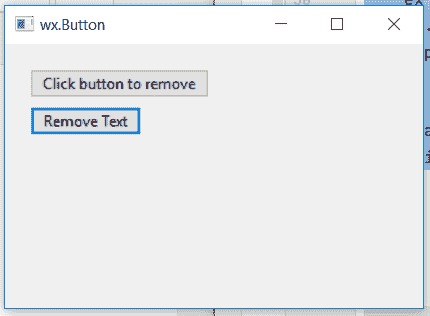

# wxPython–使用销毁()功能销毁按钮小部件

> 原文:[https://www . geesforgeks . org/wxpython-destroy-button-widget-using-destroy-function/](https://www.geeksforgeeks.org/wxpython-destroy-button-widget-using-destroy-function/)

在本文中，我们将学习如何使用 wx 中的 destroy()函数从窗口中销毁按钮小部件。wxPython 的按钮类。Destroy()函数用于简单安全地销毁窗口或小部件。
如果窗口已经被成功删除，或者已经被添加到等待真正删除的窗口列表中，则 Destroy()返回 True。

> **语法:** wx。毁灭(自我)
> 
> **参数:** Destroy()函数不接受参数。
> 
> **返回类型:** bool
> 
> **如果该窗口已被成功删除，或者已被添加到等待真正删除的窗口列表中，则返回:** True。

**代码示例:**

```py
import wx

class Example(wx.Frame):

    def __init__(self, *args, **kwargs):
        super(Example, self).__init__(*args, **kwargs)
        self.InitUI()

    def InitUI(self):
        self.locale = wx.Locale(wx.LANGUAGE_ENGLISH)

        # create parent panel
        self.pnl = wx.Panel(self)

        # create a button at point (20, 50)
        self.btn1 = wx.Button(self.pnl, id = 1, label ="Remove Text", pos =(20, 50))

        # create button to destroy
        self.btn0 = wx.Button(self.pnl, id = 1, label ="Click button to remove", pos =(20, 20))

        # bind Onclick() function with button
        self.btn1.Bind(wx.EVT_BUTTON, self.Onclick)

        self.SetSize((350, 250))
        self.SetTitle('wx.Button')
        self.Centre()

    def Onclick(self, e):
        # destroy btn0 button
        self.btn0.Destroy()

def main():
    app = wx.App()
    ex = Example(None)
    ex.Show()
    app.MainLoop()

if __name__ == '__main__':
    main()
```

**输出窗口:**

*在破坏()*之前


*后灭()*