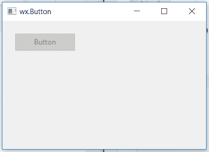

# wxPython–禁用按钮

> 原文:[https://www.geeksforgeeks.org/wxpython-disable-button/](https://www.geeksforgeeks.org/wxpython-disable-button/)

在本文中，我们将学习如何禁用框架中的按钮。有时，当我们不希望用户按下按钮时，我们可以禁用按钮，按钮变得不可点击。
为了禁用一个按钮，我们可以使用与 wx 关联的 disable()函数。wxPython 的按钮类。

> **语法:** wx。按钮。禁用(自)
> 
> **参数:**禁用()功能不需要参数。

**代码示例:**

```py
import wx

class Example(wx.Frame):

    def __init__(self, *args, **kwargs):
        super(Example, self).__init__(*args, **kwargs)
        self.InitUI()

    def InitUI(self):
        self.locale = wx.Locale(wx.LANGUAGE_ENGLISH)
        self.pnl = wx.Panel(self)
        bmp = wx.Bitmap('download.jpg')

        # CREATE BUTTON AT POINT (20, 20)
        self.st = wx.Button(self.pnl, id = 1, label ="Button", pos =(20, 20),
                                size =(100, 30),  name ="button")
        # SET BUTTON DISABLED
        self.st.Disable()
        self.SetSize((350, 250))
        self.SetTitle('wx.Button')
        self.Centre()

def main():
    app = wx.App()
    ex = Example(None)
    ex.Show()
    app.MainLoop()

if __name__ == '__main__':
    main()
```

**输出图像:**
