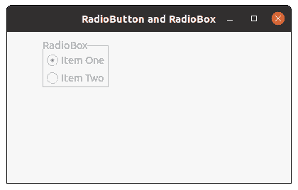

# wxPython–禁用框架中的无线电盒

> 原文:[https://www . geeksforgeeks . org/wxpython-disable-radio-box-in-present-frame/](https://www.geeksforgeeks.org/wxpython-disable-radio-box-present-in-frame/)

在本文中，我们将学习如何禁用框架中的无线电盒。为了做到这一点，我们将使用 Disable()方法，使整个无线电盒禁用和不可选择。如果窗口已被禁用，Disable()方法返回 True，如果在调用此函数之前已被禁用，则返回 False。

Disable()函数不接受参数。

> **语法:** wx。无线电盒。禁用(自)
> 
> **参数**禁用无线电盒不需要参数
> 
> **返回:**如果窗口已经被禁用，则返回真；如果在调用该函数之前已经被禁用，则返回假。
> 
> **返回类型:** bool

**代码示例:**

```
import wx

class FrameUI(wx.Frame):

    def __init__(self, parent, title):
        super(FrameUI, self).__init__(parent, title = title, size =(300, 200))

        # function for in-frame components
        self.InitUI()

    def InitUI(self):
        # parent panel for radio box
        pnl = wx.Panel(self)

        # list of choices
        hlist = ['Item One', 'Item Two']
        vlist =['Item One', 'Item Two']

        # create radio box with items in horizontal orientation
        self.rbox = wx.RadioBox(pnl, label ='RadioBox', pos =(50, 10), choices = hlist,
                              majorDimension = 0, style = wx.RA_SPECIFY_ROWS)

        # create radio box with items in vertical orientation
        self.rbox.Disable()

        # set frame in centre
        self.Centre()
        # set size of frame
        self.SetSize((400, 250))
        # show output frame
        self.Show(True)

# wx App instance
ex = wx.App()
# Example instance
FrameUI(None, 'RadioButton and RadioBox')
ex.MainLoop()
```

**输出窗口:**
