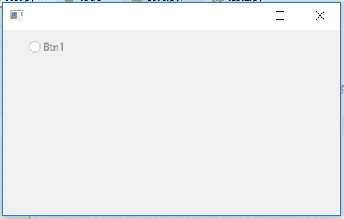

# wxPython–禁用单选按钮

> 原文:[https://www . geesforgeks . org/wxpython-disable-单选按钮/](https://www.geeksforgeeks.org/wxpython-disable-radio-button/)

在本文中，我们将学习如何禁用框架中的单选按钮。有时，当我们不希望用户按下按钮时，我们可以禁用按钮，按钮变得不可点击。
为了禁用一个按钮，我们可以使用与 wx 关联的 disable()函数。wxPython 的 RadioButton 类。

> **语法:** wx。单选按钮。禁用(自)
> 
> **参数:**禁用()功能不需要参数
> 
> **返回类型:** bool
> 
> **返回:**如果窗口已经被禁用，则返回真；如果在调用该函数之前已经被禁用，则返回假。

**代码示例:**

```py
import wx

APP_EXIT = 1

class Example(wx.Frame):

    def __init__(self, *args, **kwargs):
        super(Example, self).__init__(*args, **kwargs)

        self.InitUI()

    def InitUI(self):

        # create parent panel for radio buttons
        self.pnl = wx.Panel(self)

        # create radio button at position (30, 10)
        self.rb1 = wx.RadioButton(self.pnl, label ='Btn1', 
                             pos =(30, 10), size =(100, 20))

        # disable the radio button
        self.rb1.Disable()

def main():
    app = wx.App()
    ex = Example(None)
    ex.Show()
    app.MainLoop()

if __name__ == '__main__':
    main()
```

**输出窗口:**
