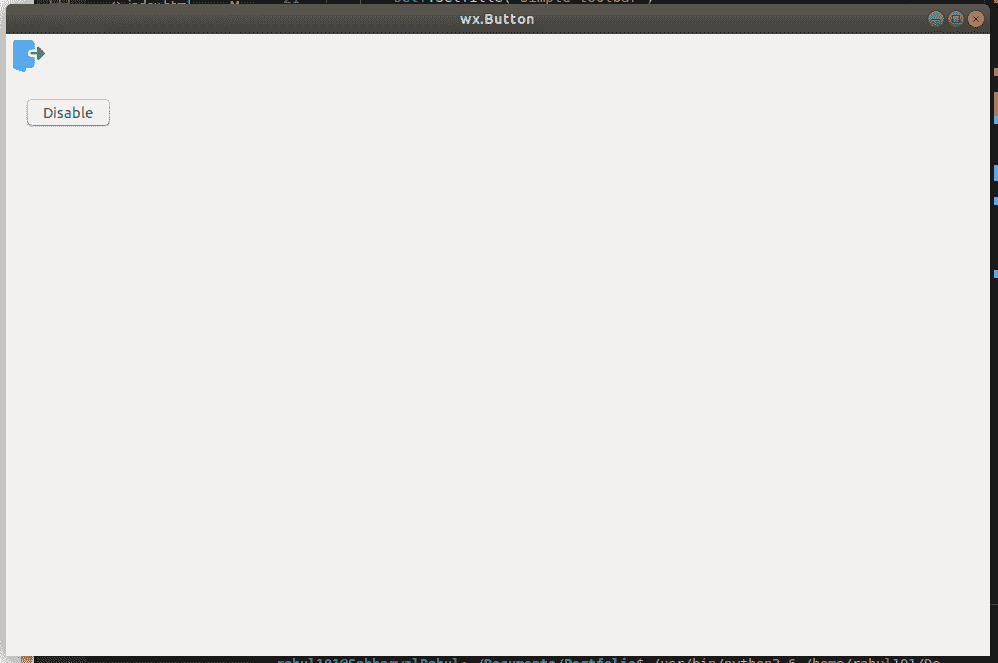
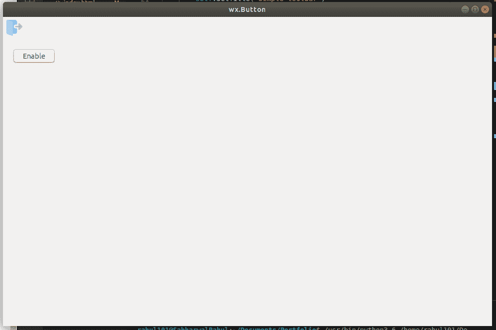

# wxPython–使用按钮

动态启用和禁用工具栏中的工具

> 原文:[https://www . geesforgeks . org/wxpython-动态启用和禁用-工具栏中的工具-使用-按钮/](https://www.geeksforgeeks.org/wxpython-dynamically-enable-and-disable-tools-in-toolbar-using-button/)

在本文中，我们将学习如何使用单个按钮动态启用和禁用。我们将用一个工具创建一个按钮和一个工具栏。我们将使用一个像切换按钮一样的普通按钮。

> **步骤:**
> 
> **1。**在框架中创建工具栏。
> T3】2。添加具有一定 id 的工具。
> **3。**窗口中的创建按钮。
> **4。**声明一个全局计数变量，并将其初始化为零。
> **5。**点击按钮时增加。
> **6。**如果计数为偶数，则启用工具否则禁用工具。

**代码示例:**

```
import wx

class Example(wx.Frame):

    def __init__(self, *args, **kwargs):
        super(Example, self).__init__(*args, **kwargs)

        self.InitUI()

    def InitUI(self):
        pnl = wx.Panel(self)
        self.toolbar = self.CreateToolBar()
        qtool = self.toolbar.AddTool(12, 'Quit', 
                     wx.Bitmap('/Desktop/wxPython/signs.png'))
        self.toolbar.Realize()

        self.Bind(wx.EVT_TOOL, self.OnQuit, qtool)

        self.SetSize((350, 250))
        self.SetTitle('Simple toolbar')
        self.Centre()
        self.btn = wx.Button(pnl, label ='Close', pos =(20, 20))

        self.btn.Bind(wx.EVT_BUTTON, self.Onclick)

        self.SetSize((350, 250))
        self.SetTitle('wx.Button')
        self.Centre()

    def OnQuit(self, e):
        self.Close()

    def Onclick(self, e):
        # disable tool using EnableTool
        self.toolbar.EnableTool(12, False)

def main():

    app = wx.App()
    ex = Example(None)
    ex.Show()
    app.MainLoop()

if __name__ == '__main__':
    main()
```

**输出:**

*启用:*

*禁用:*
