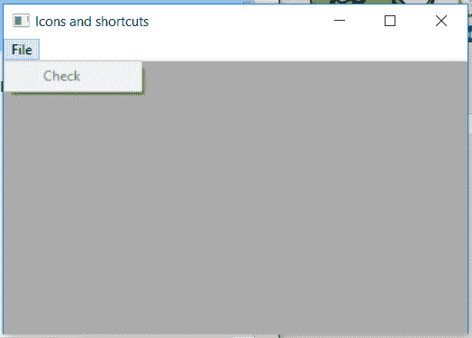

# wxPython–在 wx 中启用()功能。菜单项

> 原文:[https://www . geesforgeks . org/wxpython-enable-function-in-wx-menuitem/](https://www.geeksforgeeks.org/wxpython-enable-function-in-wx-menuitem/)

在本文中，我们将了解与 wx 相关联的 Enable()函数。wxPython 的 MenuItem 类。顾名思义，启用()功能可以启用或禁用菜单项。
它只接受布尔参数使能，使能为真，禁用为假。

> **语法:** wx。菜单项。启用(自身，启用=真)
> 
> **参数:**
> 
> | 参数 | 输入类型 | 描述 |
> | --- | --- | --- |
> | 使能够 | 弯曲件 | 启用时为真，禁用时为假。 |

**Code Example:**

```py
import wx

class Example(wx.Frame):

    def __init__(self, *args, **kwargs):
        super(Example, self).__init__(*args, **kwargs)

        self.InitUI()

    def InitUI(self):
        self.locale = wx.Locale(wx.LANGUAGE_ENGLISH)

        self.menubar = wx.MenuBar()
        self.fileMenu = wx.Menu()
        self.item = wx.MenuItem(self.fileMenu, 1, '&Check')
        self.fileMenu.Append(self.item)

        # Disable menu item using Enable() function
        self.item.Enable(enable = False)
        self.menubar.Append(self.fileMenu, '&File')
        self.SetMenuBar(self.menubar)

        self.SetSize((350, 250))
        self.SetTitle('Icons and shortcuts')
        self.Centre()

def main():
    app = wx.App()
    ex = Example(None)
    ex.Show()
    app.MainLoop()

if __name__ == '__main__':
    main()
```

**输出:**
