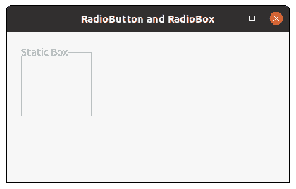

# wxPython–在 wx 中启用()方法。静态框

> 原文:[https://www . geesforgeks . org/wxpython-enable-method-in-wx-static box/](https://www.geeksforgeeks.org/wxpython-enable-method-in-wx-staticbox/)

在本文中，我们将学习与 wx 相关联的 Enable()方法。wxPython 的 StaticBox 类。Enable()函数仅用于启用或禁用该框，而不影响其标签窗口(如果有)。
如果为真，则取布尔“启用”参数，否则窗口将禁用该参数。

> **语法:** wx。静态框。启用(自我，启用=真)
> 
> **参数**
> 
> | 参数 | 输入类型 | 描述 |
> | --- | --- | --- |
> | 使能够 | 弯曲件 | 如果为 true，则启用该窗口，否则禁用它 |

**代码示例:**

```py
import wx

class FrameUI(wx.Frame):

    def __init__(self, parent, title):
        super(FrameUI, self).__init__(parent, title = title, size =(300, 200))

        # function for in-frame components
        self.InitUI()

    def InitUI(self):
        # parent panel for radio box
        pnl = wx.Panel(self)

        # create static box
        self.sb = wx.StaticBox(pnl, 2, label ="Static Box", 
                               pos =(20, 20), size =(100, 100))

        # disable static box
        self.sb.Enable(False)

        # set frame in centre
        self.Centre()
        # set size of frame
        self.SetSize((400, 250))
        # show output frame
        self.Show(True)

# wx App instance
ex = wx.App()
# Example instance
FrameUI(None, 'RadioButton and RadioBox')
ex.MainLoop()
```

**输出窗口:**
