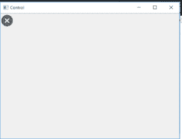
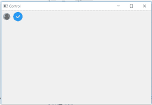

# wxPython |启用 wxPython 中的 Tool()功能

> 原文:[https://www . geeksforgeeks . org/wxpython-enable tool-function-in-wxpython/](https://www.geeksforgeeks.org/wxpython-enabletool-function-in-wxpython/)

在本文中，我们将学习 wx 的 EnableTool()函数。wxPython 的工具栏类。这是 wx 中的另一个重要功能。工具栏类。EnableTool()函数用于启用或禁用工具栏中的特定工具。它采用“启用”bool 参数，该参数为真时启用工具，为假时禁用工具。

> **语法:**
> 
> ```
> wx.toolbar.EnableTool(self, ttolid, enable)
> 
> ```
> 
> **参数:**
> 
> | 参数 | 输入类型 | 描述 |
> | --- | --- | --- |
> | 椅子 | （同 Internationalorganizations）国际组织 | 一个整数，通过它可以在后续操作中识别工具。 |
> | 使能够 | 弯曲件 | 如果为真，则启用该工具，否则禁用它。 |

**代码示例 1:**

```
import wx

class Example(wx.Frame):
    global count
    count = 0;

    def __init__(self, *args, **kwargs):
        super(Example, self).__init__(*args, **kwargs)

        self.InitUI()

    def InitUI(self):
        self.locale = wx.Locale(wx.LANGUAGE_ENGLISH)
        pnl = wx.Panel(self)
        self.toolbar = self.CreateToolBar()
        # Add Tools Using AddTool function
        rtool = self.toolbar.AddTool(13, 'twoTool', wx.Bitmap('wrong.png'), shortHelp ="Simple Tool2")

        self.toolbar.Realize()
        self.SetSize((350, 250))
        self.SetTitle('Control')
        self.Centre()

        # disable tool in toolbar
        self.toolbar.EnableTool(13, False)

def main():
    app = wx.App()
    ex = Example(None)
    ex.Show()
    app.MainLoop()

if __name__ == '__main__':
    main()
```

**输出窗口:**


**代码示例 2:**

```
import wx

class Example(wx.Frame):
    global count
    count = 0;

    def __init__(self, *args, **kwargs):
        super(Example, self).__init__(*args, **kwargs)

        self.InitUI()

    def InitUI(self):
        self.locale = wx.Locale(wx.LANGUAGE_ENGLISH)
        pnl = wx.Panel(self)
        self.toolbar = self.CreateToolBar()
        # Add Tools Using AddTool function
        rtool = self.toolbar.AddTool(13, 'twoTool', wx.Bitmap('user.png'), shortHelp ="Simple Tool2")
        stool = self.toolbar.AddTool(14, 'twoTool', wx.Bitmap('right.png'), shortHelp ="Simple Tool2")

        self.toolbar.Realize()
        self.SetSize((350, 250))
        self.SetTitle('Control')
        self.Centre()

        # disable tool in toolbar
        self.toolbar.EnableTool(13, False)

def main():
    app = wx.App()
    ex = Example(None)
    ex.Show()
    app.MainLoop()

if __name__ == '__main__':
    main()
```

**输出窗口:**
