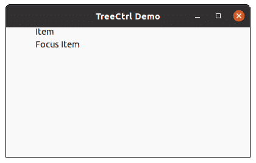

# wx xpython–在 wx 中确保可见()方法。TreeCtrl

> 原文:[https://www . geesforgeks . org/wxpython-ensurevisible-method-in-wx-tree ctrl/](https://www.geeksforgeeks.org/wxpython-ensurevisible-method-in-wx-treectrl/)

在本文中，我们将了解与 wx 相关联的 EnsureVisible()函数。wxPython 的 TreeCtrl 类。EnsureVisible()方法使项目/根在屏幕上可见。滚动和/或展开项目以确保给定项目可见。

这种方法是可以使用的，并且会起作用，甚至在窗口冻结的时候(见 wx。窗口。冻结)。

> **语法:** wx。TreeCtrl .可稽核()
> 
> **参数:**
> 
> <figure class="table">
> 
> | **参数** | **类型** | **描述** |
> | 项目 | wx(地名)。TreeItemId(树项目 Id) | 我们希望确保可见的项目。 |
> 
> </figure>

**代码示例:**

## 蟒蛇 3

```py
import wx

class TreePanel(wx.Panel):

    def __init__(self, parent):
        wx.Panel.__init__(self, parent)

        self.tree = wx.TreeCtrl(self, wx.ID_ANY, wx.DefaultPosition, (100, 50),
                           wx.TR_HAS_BUTTONS)
        # create tree root
        self.root = self.tree.AddRoot('root')
        self.tree.SetPyData(self.root, ('key', 'value'))

        # add items to root
        item = self.tree.AppendItem(self.root, "Item")
        item2 = self.tree.AppendItem(self.root, "Item")
        item3 = self.tree.AppendItem(self.root, "Item")
        item4 = self.tree.AppendItem(self.root, "Item")
        focusitem = self.tree.AppendItem(self.root, "Focus Item")

        # expand root
        self.tree.Expand(self.root)

        self.tree.EnsureVisible(focusitem)

        sizer = wx.BoxSizer(wx.VERTICAL)
        sizer.Add(self.tree, 0, wx.EXPAND)
        self.SetSizer(sizer)

    def onclick(self, e):
        # Delete si2 from the tree
        self.tree.Delete(self.si2)

class MainFrame(wx.Frame):

    def __init__(self):
        wx.Frame.__init__(self, parent = None, title ='TreeCtrl Demo')
        panel = TreePanel(self)
        self.Show()

if __name__ == '__main__':
    app = wx.App(redirect = False)
    frame = MainFrame()
    app.MainLoop()
```

**输出:**

