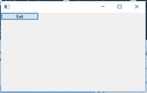

# wxPython 中的 wxPython | Exit()功能

> 原文:[https://www . geeksforgeeks . org/wxpython-exit-function-in-wxpython/](https://www.geeksforgeeks.org/wxpython-exit-function-in-wxpython/)

在本文中，我们将了解 wx。Exit()是 wxPython 中存在的内置父函数。Exit()函数在调用 wx 后退出应用程序。App.OnExit。

仅应在紧急情况下使用:通常应删除顶层框架(删除所有其他框架后)以终止应用程序。参见 wx。CloseEvent 和 wx.App。

> **语法:**
> wx。出口()
> 
> **参数:**
> Exit()函数不需要参数

**编码示例:**

```
import wx

class Example(wx.Frame):

    def __init__(self, *args, **kwargs):
        super(Example, self).__init__(*args, **kwargs)

        self.InitUI()

    def InitUI(self):

        self.locale = wx.Locale(wx.LANGUAGE_ENGLISH)
        self.panel = wx.Panel(self, pos =(100, 100), size =(100, 100))
        self.btn = wx.Button(self.panel, id = 2, label ="Exit", pos = wx.DefaultPosition, size =(100, 20))

        self.Bind(wx.EVT_BUTTON, self.onclick, self.btn)

    def onclick(self, e):
        # EXITS APPLICATION ON CLICKING EXIT BUTTON
        wx.Exit()

def main():
    app = wx.App()
    ex = Example(None)
    ex.Show()
    app.MainLoop()

if __name__ == '__main__':
    main()
```

**输出窗口:**
