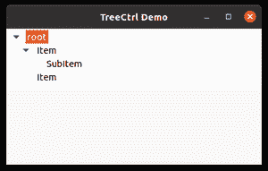

# wx 中的 wxPython–ExpandAll()方法。TreeCtrl

> 原文:[https://www . geesforgeks . org/wxpython-expandall-method-in-wx-tree ctrl/](https://www.geeksforgeeks.org/wxpython-expandall-method-in-wx-treectrl/)

在本文中，我们将学习与 wx 相关联的 ExpandAll()方法。wxPython 的 TreeCtrl 类。ExpandAll()方法与 Expand()类似，但唯一的区别是该方法用于展开树控件中存在的所有项。使用此方法，所有子节点及其父节点都是可见的。

此方法不需要任何参数。

> **语法:** wx。TreeCtrl.ExpandAll(自我)
> 
> **参数:**
> 
> 此方法不需要任何参数。

**代码示例:**

## 计算机编程语言

```
import wx 

class MyTree(wx.TreeCtrl): 

    def __init__(self, parent, id, pos, size, style): 
        wx.TreeCtrl.__init__(self, parent, id, pos, size, style) 

class TreePanel(wx.Panel): 

    def __init__(self, parent): 
        wx.Panel.__init__(self, parent) 

        # create tree control in window 
        self.tree = MyTree(self, wx.ID_ANY, wx.DefaultPosition, 
                           wx.DefaultSize, wx.TR_HAS_BUTTONS) 

        # CREATE TREE ROOT 
        self.root = self.tree.AddRoot('root') 
        self.tree.SetPyData(self.root, ('key', 'value')) 

        # add item to root 
        item = self.tree.AppendItem(self.root, "Item") 
        item2 = self.tree.AppendItem(self.root, "Item") 
        item3 = self.tree.AppendItem(item, "SubItem")

        # expand all nodes of the tree
        self.tree.ExpandAll() 

        sizer = wx.BoxSizer(wx.VERTICAL) 
        sizer.Add(self.tree, 0, wx.EXPAND) 
        self.SetSizer(sizer) 

class MainFrame(wx.Frame): 

    def __init__(self): 
        wx.Frame.__init__(self, parent = None, title ='TreeCtrl Demo') 
        panel = TreePanel(self) 
        self.Show() 

if __name__ == '__main__': 
    app = wx.App(redirect = False) 
    frame = MainFrame() 
    app.MainLoop()
```

**输出:**

