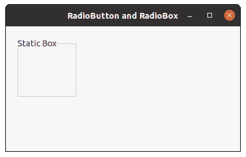

# wxPython–获取静态框的视觉属性

> 原文:[https://www . geesforgeks . org/wxpython-get-visual-attributes-of-static-box/](https://www.geeksforgeeks.org/wxpython-get-visual-attributes-of-static-box/)

在本文中，我们将学习如何获得 wx。与静态框相关联的可视属性。为此，我们将使用静态 GetClassDefaultAttributes()函数。GetClassDefaultAttributes()函数用于返回 wx。VisualAttributes 对象，用于背景色、前景色和字体等属性。

> **语法:** wx。
> 参数
> 
> <figure class="table">
> 
> | 参数 | 输入类型 | 描述 |
> | --- | --- | --- |
> | 不同的 | WindowVariant | 与静态框关联变量。 |
> 
> </figure>
> 
> **返回类型:** wx。视觉属性

**代码示例:**

## 蟒蛇 3

```
import wx

class FrameUI(wx.Frame):

    def __init__(self, parent, title):
        super(FrameUI, self).__init__(parent, title = title, size =(300, 200))

        # function for in-frame components
        self.InitUI()

    def InitUI(self):
        # parent panel for radio box
        pnl = wx.Panel(self)

        # create static box
        self.sb = wx.StaticBox(pnl, 2, label ="Static Box",
                              pos =(20, 20), size =(100, 100))

        # wx.VisualAttributes object
        va = self.sb.GetClassDefaultAttributes(wx.WINDOW_VARIANT_NORMAL)

        # background and foreground colours
        print (va.colBg)
        print (va.colFg)

        # set frame in centre
        self.Centre()
        # set size of frame
        self.SetSize((400, 250))
        # show output frame
        self.Show(True)

# wx App instance
ex = wx.App()
# Example instance
FrameUI(None, 'RadioButton and RadioBox')
ex.MainLoop()
```

**控制台输出:**

```
(247, 247, 247, 255)
(61, 61, 61, 255)
```

**输出窗口:**

